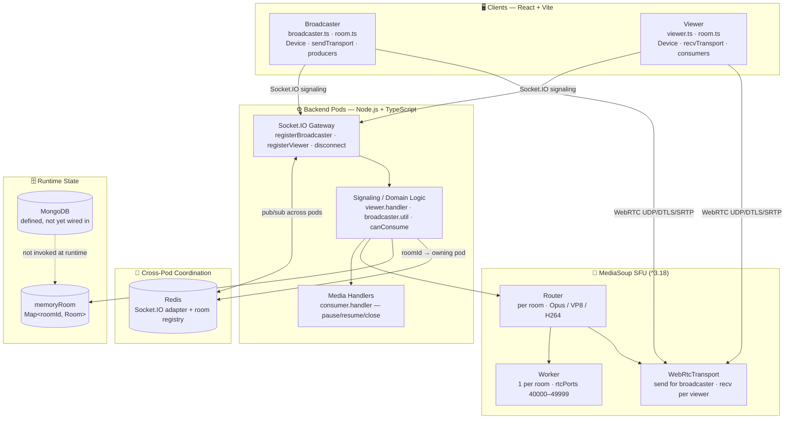
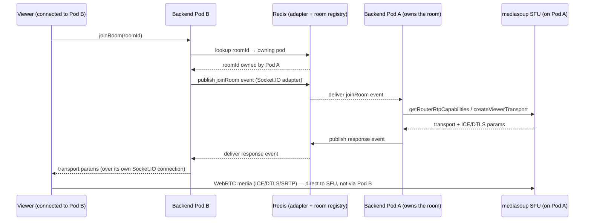
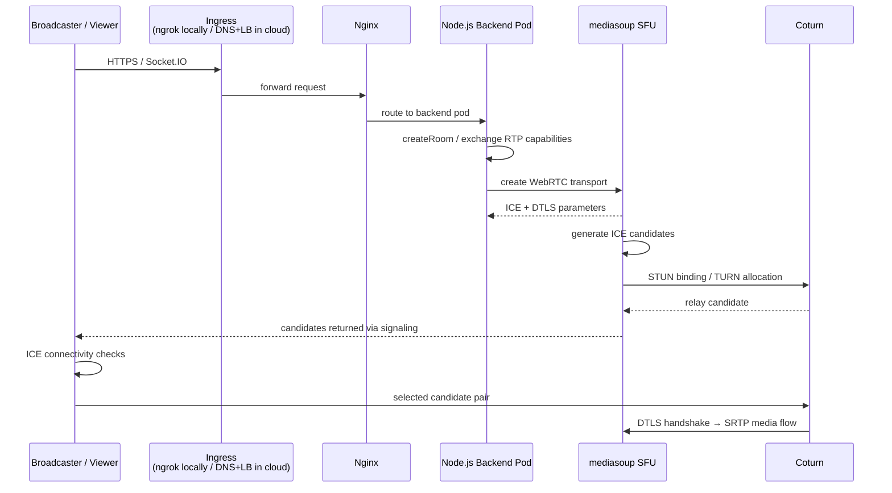
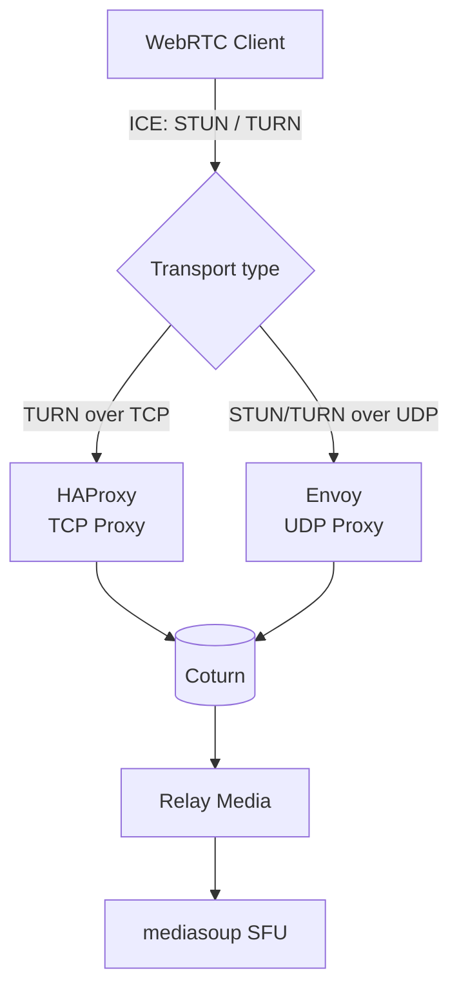

# 🎥 CrowdStream

**Broadcast. Watch. Connect — live.**

Self-hosted, real-time live streaming infrastructure built for scale. CrowdStream enables **low-latency broadcaster-to-audience sessions** with live chat, reactions, co-broadcasting, and viewer presence — with no third-party streaming dependency, and no cloud vendor lock-in.

---

## 📖 Table of Contents

- [Overview](#-overview)
- [Key Features](#-key-features)
- [Architecture](#-architecture)
- [Multi-Pod Signaling](#-multi-pod-signaling)
- [Deployment Topology — Local ↔ Cloud](#-deployment-topology--local--cloud)
- [NAT Traversal: HAProxy + Envoy in Front of Coturn](#-nat-traversal-haproxy--envoy-in-front-of-coturn)
- [Key Flows](#-key-flows)
- [Tech Stack](#-tech-stack)
- [Status](#-status)
- [Contact](#-contact)

---

## Overview

CrowdStream is a **one-to-many live video streaming** system. A *broadcaster* captures camera and mic and publishes media; many *viewers* subscribe and consume it. Media never flows peer-to-peer — it routes through a **mediasoup SFU** on the backend. Socket.IO carries all signaling; audio/video itself travels over WebRTC (UDP/DTLS/SRTP), traversing STUN/TURN when a direct path isn't available.

The full stack — signaling, SFU, NAT traversal, and multi-pod room routing — has been built and validated end to end **on a local, self-hosted topology**. The design is intentionally cloud-portable: every local component (ngrok, Nginx, HAProxy/Envoy, Coturn) maps one-to-one onto a standard cloud equivalent (public ingress, load balancer/API gateway, TURN relay), so moving to a cloud environment is a configuration swap, not a redesign.

---

## ✨ Key Features

| Area | Capability |
|---|---|
| 🎥 **Broadcasting** | Live video and audio over WebRTC, captured directly from browser camera/mic |
| 📡 **SFU Delivery** | Multi-viewer fan-out via mediasoup SFU — no peer-to-peer mesh, no transcoding |
| 💬 **Live Chat** | Real-time chat alongside the stream |
| ❤️ **Reactions** | Real-time emoji reactions |
| 🎙️ **Co-broadcasting** | Multiple active broadcasters in a single room |
| 👀 **Viewer Presence** | Live viewer count |
| 🧩 **Multi-Pod Signaling** | Viewers and broadcasters land on different backend pods but still join the same room transparently |
| 🌐 **NAT Traversal** | Self-hosted Coturn (TURN/STUN), fronted by HAProxy and Envoy |

---

## 🏗️ Architecture

CrowdStream splits cleanly into a React client (broadcaster + viewer), a Node.js signaling layer, and a mediasoup SFU that owns the actual media plane. A Redis-backed layer sits between backend pods so signaling isn't bound to a single process.

**Notes**

- **SFU model:** the broadcaster uploads one stream; the SFU fans it out to N viewers — no transcoding, no P2P mesh.
- **Runtime state is in-memory** (`memoryRoom`), scoped per pod. The MongoDB layer is defined but not yet wired into the handler flow, so room/session state doesn't survive a restart.
- **One mediasoup Worker per room** today — no worker pool yet; horizontal scaling across CPU cores within a pod is a known next step.
- **Redis** does double duty: it backs the Socket.IO adapter (cross-pod event fan-out) and holds the `roomId → pod` ownership registry described below.

---

## 🧩 Multi-Pod Signaling

A broadcaster and a viewer can land on **different backend pods** — normal behavior behind any load balancer with more than one replica — and still end up in the same room without either client being redirected or reconnected.

**How it works:**

1. When a broadcaster starts a room, the owning pod creates the mediasoup Worker/Router for that room and writes a `roomId → podId` mapping into Redis.
2. The **Socket.IO Redis adapter** connects every pod's Socket.IO instance to the same Redis pub/sub channel, so a `join-room` or chat/reaction event emitted from a socket on Pod B is transparently broadcast to sockets on Pod A (and vice versa). From the client's perspective there is a single logical signaling namespace, regardless of which pod terminated its connection.
3. When a viewer on Pod B requests to join a room owned by Pod A, the signaling layer looks up ownership in Redis and routes the mediasoup-specific calls (`getRouterRtpCapabilities`, `createViewerTransport`, `connectConsumerTransport`, `consume`) to Pod A internally — the viewer's browser still talks to its own pod over Socket.IO/HTTPS the whole time.
4. Chat, reactions, and viewer-presence events fan out to every pod via Redis pub/sub, so viewers stay in sync no matter which pod they're attached to.

**Why this matters:** clients never need to know or care which pod they're attached to, and a room isn't tied to "whichever pod the client happens to hit." This is the same pattern used to horizontally scale any Socket.IO deployment (`@socket.io/redis-adapter`), extended here with an explicit room-ownership registry so mediasoup-specific calls are routed to the one pod that actually holds the Router for that room.

---

## 🌍 Deployment Topology — Local ↔ Cloud

The current deployment is fully self-hosted and has been validated **locally**. Every layer maps directly onto a cloud equivalent — nothing in the design is local-only, so moving environments is a matter of pointing the same configuration at managed infrastructure rather than rebuilding it.

| Local component | Cloud equivalent | Role |
|---|---|---|
| ngrok | Public ingress / DNS + managed TLS | Exposes the app publicly |
| Nginx | Nginx (unchanged) or a managed reverse proxy | Routes HTTP/Socket.IO traffic to backend pods |
| HAProxy (TCP) | Cloud NLB / TCP listener | TURN-over-TCP path for clients where UDP is blocked |
| Envoy (UDP) | Cloud NLB / UDP listener | STUN/TURN-over-UDP path — the primary ICE path |
| Coturn | Coturn (unchanged) | TURN/STUN relay for NAT traversal |
| Single-pod backend | Multiple backend pods behind a load balancer | Same Socket.IO + mediasoup code, now horizontally scaled via the Redis adapter above |

---

## 🔀 NAT Traversal: HAProxy + Envoy in Front of Coturn

With no managed load balancer in the self-hosted path, TURN/STUN traffic is split across two proxies before it reaches Coturn — HAProxy handles the TCP path, Envoy handles the UDP path. This pair stands in for a cloud ALB/NLB and works identically against a cloud-hosted deployment.

- **HAProxy** proxies TURN-over-TCP connections — useful for clients on networks that block or throttle UDP.
- **Envoy** proxies the UDP path for STUN and TURN — the primary route for ICE connectivity checks and media relay.
- Both sit in front of a single **Coturn** instance, giving it one consistent entry point regardless of which transport a client's ICE agent picks.
- This layer is a like-for-like substitute for a cloud ALB/NLB; the same HAProxy/Envoy configuration runs unchanged in front of a cloud-hosted Coturn instance.

---

## 🔁 Key Flows

**Broadcast (publish):**
`createRoom` → owning pod spins up Worker + Router, registers `roomId → podId` in Redis → `getRouterRtpCapabilities` → client loads `Device` → `createBroadcasterTransport` → `connectBroadcasterTransport` (DTLS) → `produce` (video + audio) → **Producers** stored in `memoryRoom` on the owning pod.

**View (subscribe), same pod or different pod:**
`joinRoom` → signaling layer resolves the room's owning pod via Redis (transparent if it's the same pod) → load `Device` → `createViewerTransport` → `connectConsumerTransport` (DTLS) → `consume` (creates paused **Consumers** per producer, gated by `canConsume`) → `resumeConsumer` → client builds a `MediaStream` and renders. Signaling events are relayed pod-to-pod over the Socket.IO Redis adapter; the media path (WebRTC) always goes directly from the client to the SFU that owns the room.

**Teardown:**
`disconnect` → `handleDisconnect` closes transports/producers/consumers, removes the entry from `memoryRoom`, and clears the room's ownership entry from Redis.

---

## 🧰 Tech Stack

| Layer | Technology |
|---|---|
| **Backend** | Node.js, TypeScript, Socket.IO |
| **Cross-Pod Coordination** | Redis — Socket.IO adapter (pub/sub) + room-ownership registry |
| **Media** | MediaSoup (WebRTC SFU) — one worker process per room, media plane in C++ off the event loop |
| **Frontend** | React, Vite, mediasoup-client |
| **Database** | MongoDB (Mongoose) — defined, not yet wired into runtime flow |
| **NAT Traversal** | Coturn (TURN/STUN) |
| **Proxy / Ingress** | ngrok (local) / DNS + managed ingress (cloud), Nginx, HAProxy (TCP), Envoy (UDP) |
| **Media Processing** | FFmpeg (thumbnails now, recording planned) |

---

## 📞 Contact

Built by **Harshit Singh Parihar**.

Low-latency, self-hosted live streaming — no third-party dependency.

