# CrowdStream — Production Architecture

> Principal Distributed Systems Architecture for a WebRTC/MediaSoup live-streaming platform.
> This document evolves the **current** single-process signaling server into a production-scale system, then defines the MVP → growth → large-scale path.

---

## 0. Where We Are Today (Baseline)

Grounded in the current `backend/src`:

| Component | Current State | File |
|---|---|---|
| Signaling | Single-process **Socket.IO** server, port `3000`, CORS `*` | `index.ts`, `utils/socket.util.ts` |
| MediaSoup worker | **1 worker per process**, UDP `40000–49999` | `mediasoup/worker.ts` |
| Router | **1 router per room**, codecs Opus / VP8 / H.264 | `mediasoup/router.ts` |
| Transport | UDP-only, **hardcoded `announcedIp: 13.232.120.1`**, no TURN | `mediasoup/transport.ts` |
| Room store | **In-memory `Map`**, ephemeral, no persistence | `rooms/room.store.ts` |
| DB models | 5 Mongoose schemas defined but **not actively persisted** live | `models/*.ts` |
| Recording | **None** (FFmpeg not integrated) | — |
| Auth | **None** (no JWT, open WS) | — |

### Critical gaps to close for production
1. **No TURN/STUN** → clients behind symmetric NAT cannot connect. **Highest-impact blocker.**
2. **Single worker** → caps at ~1 CPU core of media (~500 consumers).
3. **Hardcoded IP** → cannot scale horizontally or multi-region.
4. **In-memory rooms** → no failover; a crash drops every live stream.
5. **No auth / rate limiting** → open to abuse and resource exhaustion.
6. **Stateful signaling** → cannot load-balance Socket.IO without sticky sessions + Redis adapter.

---

## Table of Contents
1. [High-Level Architecture](#1-high-level-architecture)
2. [Detailed Component Diagram (C4)](#2-detailed-component-diagram-c4)
3. [WebRTC Media Flow](#3-webrtc-media-flow)
4. [Data Flow](#4-data-flow)
5. [AWS Production Infrastructure](#5-aws-production-infrastructure)
6. [Scalability Plan](#6-scalability-plan)
7. [Database Design](#7-database-design)
8. [Real-Time Messaging Architecture](#8-real-time-messaging-architecture)
9. [Recording Architecture](#9-recording-architecture)
10. [Security Architecture](#10-security-architecture)
11. [Monitoring Architecture](#11-monitoring-architecture)
12. [CI/CD Architecture](#12-cicd-architecture)
13. [Disaster Recovery](#13-disaster-recovery)
14. [Cost Analysis](#14-cost-analysis)
15. [Final Recommended Architecture](#15-final-recommended-architecture)
16. [Production Readiness Checklist](#16-production-readiness-checklist)

---

## 1. High-Level Architecture

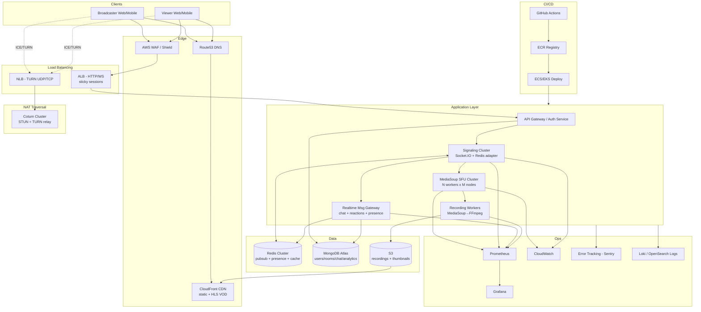

**Key separation of planes:**
- **Control plane** (signaling, chat, presence) → ALB + Socket.IO + Redis. Cheap, scales horizontally.
- **Media plane** (RTP) → MediaSoup SFU + Coturn. Expensive (bandwidth + CPU), scales vertically per worker then horizontally per node.
- **Storage/delivery plane** (VOD) → S3 + CloudFront. Decoupled from live path.

The single most important architectural principle: **never route media through the signaling tier**. Signaling carries only SDP/ICE/control JSON; RTP flows client ↔ MediaSoup directly (or via TURN relay).

---

## 2. Detailed Component Diagram (C4)

### C4 — Container Level

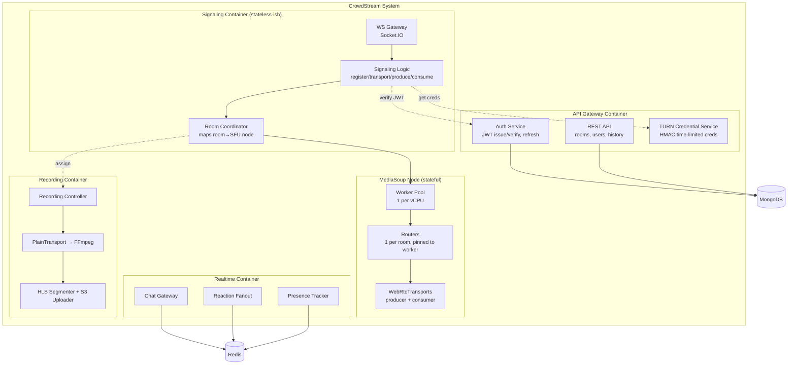

### Service boundaries & horizontal scaling strategy

| Service | State | Scale unit | Scaling trigger | Notes |
|---|---|---|---|---|
| Auth / REST API | Stateless | Pods behind ALB | CPU / RPS | Trivially horizontal |
| Signaling (Socket.IO) | Soft state (socket↔room) | Pods + **Redis adapter** + **sticky sessions** | WS connection count | Sticky needed; Redis adapter for cross-pod events |
| MediaSoup SFU | **Hard state** (RTP pinned to worker) | **Node** (vertical first: 1 worker/vCPU) | Worker CPU / consumer count | Cannot move a live router; route new rooms to least-loaded node |
| Realtime (chat/reactions) | Soft state | Pods + Redis Pub/Sub | Message throughput | Fanout via Redis channels |
| Recording | Stateful per-recording | 1 worker per active recording | # concurrent recordings | CPU + disk I/O bound (FFmpeg) |
| Coturn | Stateless relay | Nodes behind NLB | Relayed bandwidth | Bandwidth-bound, not CPU |

**The hard rule for MediaSoup:** a router is pinned to a worker, a worker is pinned to a node. You scale by **placing new rooms** on the least-loaded worker/node — never by migrating live media. The Room Coordinator (`ROOMSVC`) owns this placement decision and persists `room → node` mapping in Redis so signaling pods agree on where a room lives.

---

## 3. WebRTC Media Flow

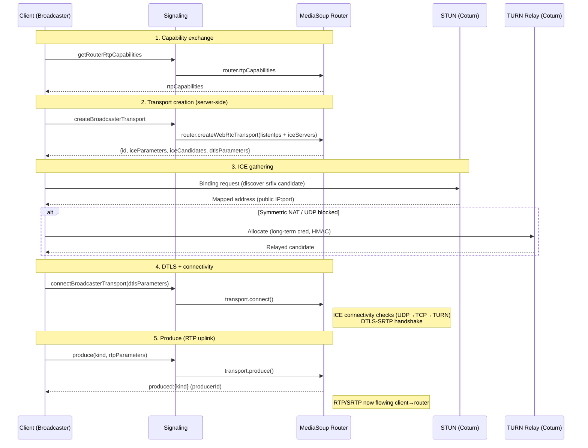

### Consumer (viewer) path

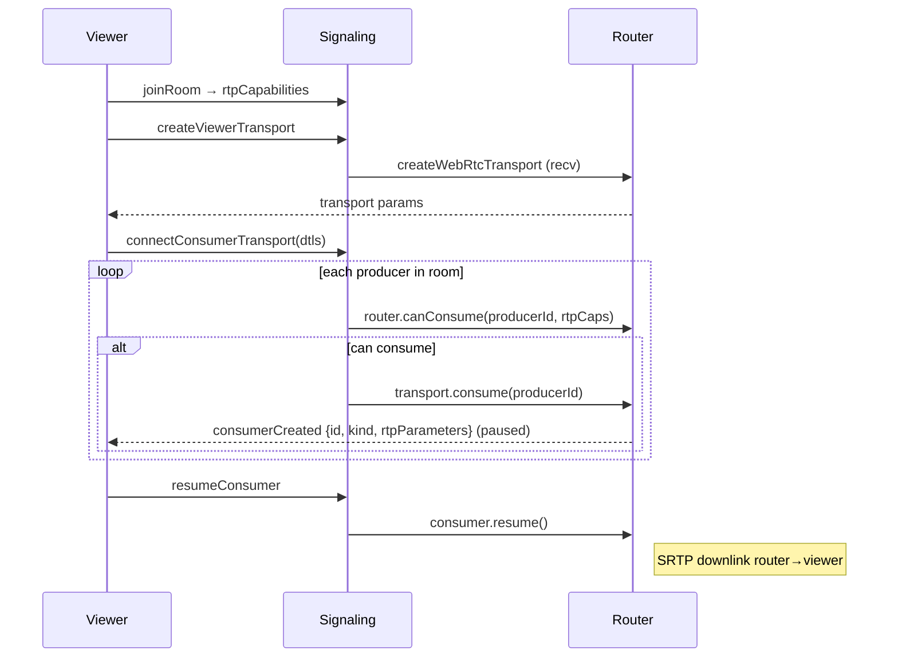

> **Note:** Consumers are created **paused** and resumed after the client wires up the track — this avoids losing the first keyframe. This matches the `consume` → `resumeConsumer` flow already in `registerViewer.handler.ts`.

### Transport lifecycle
`create → connect (DTLS) → produce/consume → pause/resume → close (on disconnect)`. Cleanup on disconnect already exists in `disconnect.handlers.ts` (`cleanupViewer`, `cleanUpBroadcaster`) — production-correct; keep it and add a TTL sweep for zombie transports.

### ICE server config to add (`transport.ts`)
```ts
const transport = await router.createWebRtcTransport({
  listenIps: [{ ip: "0.0.0.0", announcedIp: process.env.ANNOUNCED_IP }], // de-hardcode
  enableUdp: true,
  enableTcp: true,   // enable TCP fallback (currently false)
  preferUdp: true,
  initialAvailableOutgoingBitrate: 1_000_000,
});
// iceServers (STUN/TURN) are supplied to the CLIENT, not the server transport:
// client passes them into the RTCPeerConnection / mediasoup-client Device.
```

---

## 4. Data Flow

### 4a. Broadcaster starts stream
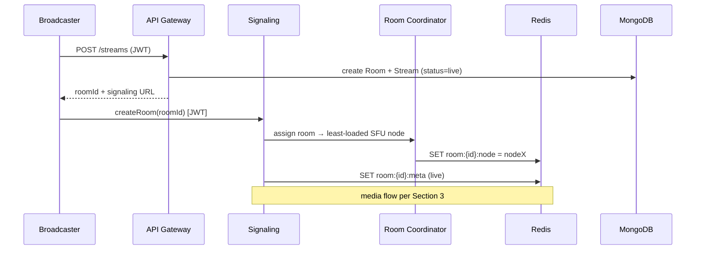

### 4b. Viewer joins & subscribes
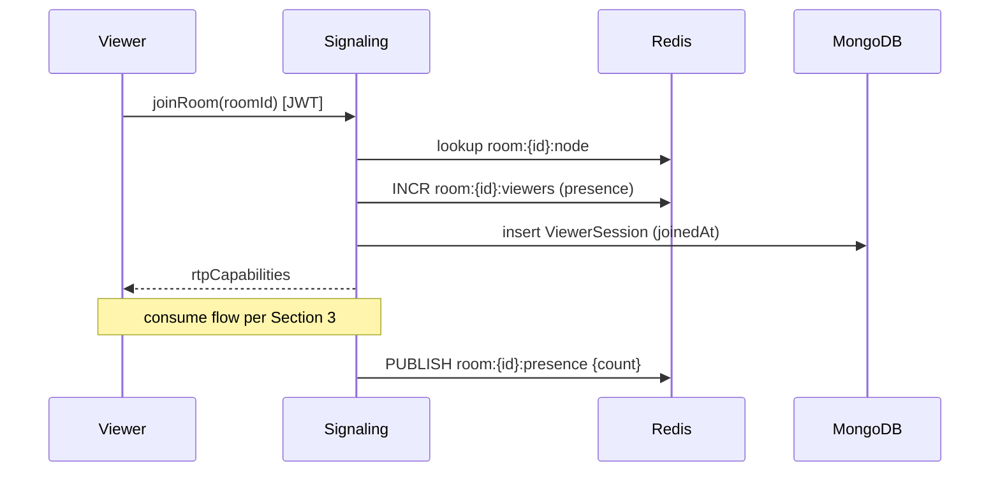

### 4c. Reaction fanout
```mermaid
sequenceDiagram
    participant V as Viewer
    participant CHAT as Realtime GW
    participant R as Redis PubSub
    participant OTHERS as All viewers
    V->>CHAT: reaction {emoji} [rate-limited]
    CHAT->>R: PUBLISH room:{id}:reactions {emoji,ts}
    R-->>CHAT: fanout to subscribed gateways
    CHAT-->>OTHERS: emit reaction (batched 100–250ms)
    Note over CHAT: NOT persisted individually;<br/>aggregated counts → analytics
```

### 4d. Chat message
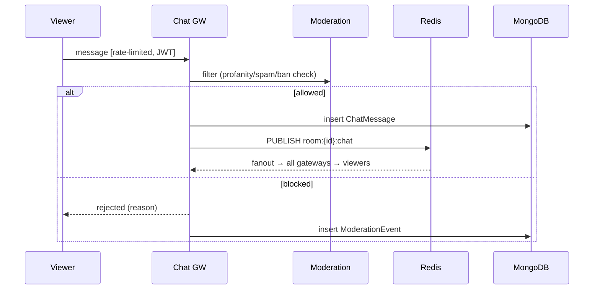

### 4e. Recording starts
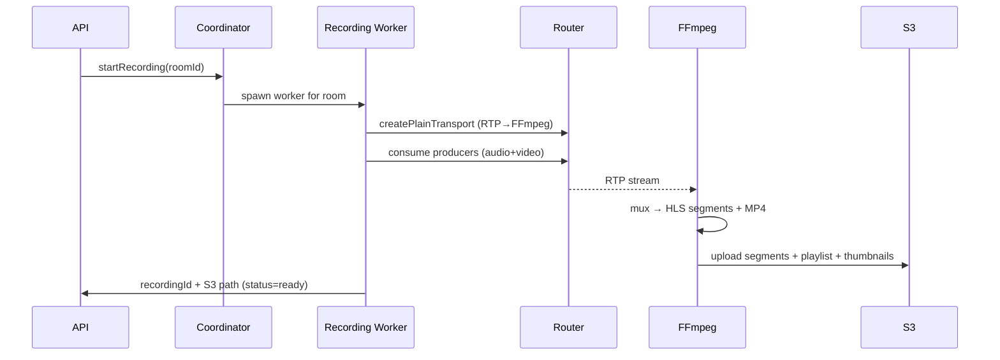

---

## 5. AWS Production Infrastructure

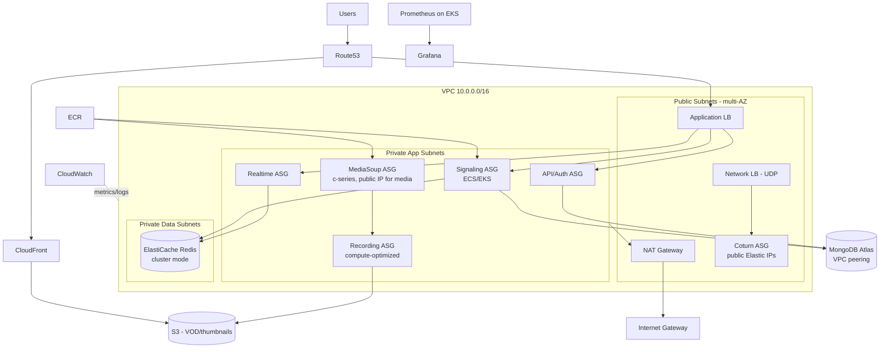

### Networking & placement notes
- **MediaSoup nodes need public IPs** (or Elastic IPs) because `announcedIp` must be reachable for ICE. They sit in private subnets but with a public IP / EIP per node — this is the one exception to "app tier is fully private." Lock down via Security Groups (only UDP `40000–49999` + TURN).
- **Coturn** runs in public subnets behind an **NLB** (UDP/TCP passthrough; ALB cannot do UDP).
- **Redis** and **Mongo Atlas** (via VPC peering) live in private data subnets — no public access.
- **Security Groups:**
  - ALB SG: `443/80` from `0.0.0.0/0`.
  - SFU SG: UDP `40000–49999` + TCP fallback from `0.0.0.0/0`; signaling control port only from ALB/signaling SG.
  - Redis SG: `6379` only from app SGs.

### ECS vs Kubernetes recommendation

| Stage | Recommendation | Why |
|---|---|---|
| MVP | **ECS Fargate** for API/signaling/chat; **EC2 (not Fargate)** for MediaSoup & Coturn | Fargate can't expose the wide UDP port range MediaSoup needs; SFU must be EC2 with host networking |
| Growth | **ECS on EC2** capacity providers, or start EKS | Manage SFU placement with EC2 + custom ASG |
| Large scale | **EKS (Kubernetes)** | Need advanced scheduling, multi-region, GitOps, node pools per workload class |

> **Recommendation: start ECS, graduate to EKS at the growth→scale boundary.** Run MediaSoup and Coturn on **EC2 with host networking** regardless of orchestrator — the UDP port range and public-IP requirement make Fargate unsuitable for the media plane.

---

## 6. Scalability Plan

### Per-worker math
A MediaSoup worker = 1 CPU core, sustains roughly **500 consumers** of 720p (~1.5 Mbps) before CPU/encryption saturates. Bandwidth is usually the real wall first:
- 1 viewer @ 720p ≈ **1.5 Mbps** down.
- 10k viewers ≈ **15 Gbps** egress — this is the dominant cost and constraint, not CPU.

### Scaling tiers

| Viewers | Topology | Workers / Nodes | Primary bottleneck | Mitigation |
|---|---|---|---|---|
| **100** | Single SFU node, 1–2 workers | 1 node (4 vCPU) | None | Just add TURN + auth |
| **1,000** | Single beefy SFU node | 4–8 workers, 1 node | Node NIC (~1.5 Gbps) | c5n.2xlarge (up to 25 Gbps NIC) |
| **10,000** | **Multi-node SFU + piping** | ~20 workers across 4–6 nodes | Egress bandwidth (~15 Gbps), worker CPU | **Pipe producers** across routers/nodes (fanout tree); add nodes horizontally |
| **100,000** | **SFU cascade + HLS hybrid** | 40+ nodes OR switch most viewers to HLS/CDN | Cost & bandwidth explode | **Hybrid: WebRTC for low-latency tier, HLS via CloudFront for the long tail** |

### The 100k insight — hybrid delivery
Pure WebRTC SFU to 100k viewers is economically irrational (you pay AWS egress for every bit, ~$0.05–0.08/GB). At that scale:
- Keep **WebRTC** for the interactive tier (co-hosts, first few thousand low-latency viewers).
- **Transcode once to HLS/LL-HLS** (the FFmpeg pipeline you already need for recording) and serve the massive passive audience through **CloudFront** at ~$0.02/GB with edge caching. Latency rises to 2–6s (LL-HLS ~2s) but cost drops 10×+ and it scales effectively infinitely.

### SFU fan-out (10k tier)
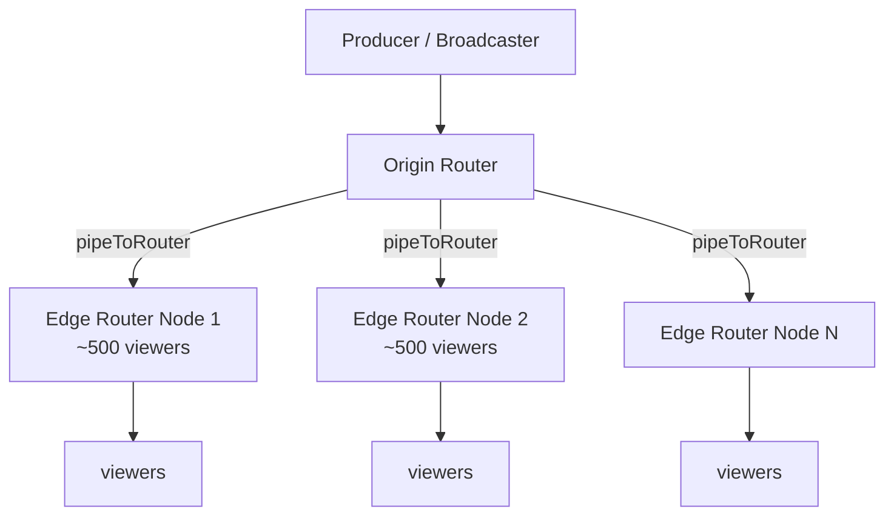
MediaSoup's `pipeToRouter` relays one producer to other routers/nodes; each edge router serves ~500 local consumers. This turns a flat SFU into a distribution tree.

### Bottleneck summary
- **Network:** egress bandwidth is the #1 constraint and cost driver. NIC caps (~25 Gbps on c5n) bound per-node viewer count.
- **CPU:** SRTP encryption per consumer; ~500 consumers/core.
- **MediaSoup workers:** 1 per vCPU, hard ceiling; scale by adding workers/nodes, never by overloading one.
- **Signaling:** Socket.IO connection count per pod (~10–30k WS/pod with tuning); scale pods + Redis adapter.

---

## 7. Database Design

MongoDB (Atlas) for flexible documents; Redis for hot ephemeral state. Schemas below extend your existing `models/`.


### Collections

**users**
```js
{ _id, username, email, passwordHash, displayName, avatarUrl,
  roles: ["user"|"broadcaster"|"admin"|"moderator"],
  refreshTokenHash, banned: Boolean, createdAt, updatedAt }
// idx: { email:1 } unique, { username:1 } unique
```

**rooms** (persistent room/channel)
```js
{ _id, ownerId→users, title, slug, visibility: "public"|"private"|"unlisted",
  status: "idle"|"live"|"ended", currentStreamId, createdAt }
// idx: { ownerId:1 }, { slug:1 } unique, { status:1 }
```

**streams** (one live session)
```js
{ _id, roomId→rooms, hostUserId→users, status: "live"|"ended",
  sfuNodeId, startedAt, endedAt, peakViewers, recordingId, createdAt }
// idx: { roomId:1, startedAt:-1 }, { status:1, sfuNodeId:1 }
```

**viewer_sessions** (extends your `viewer.model.ts`)
```js
{ _id, streamId→streams, userId→users, socketId,
  joinedAt, leftAt, watchDurationSec, role: "viewer"|"co-host",
  clientInfo:{ ua, ip(hashed), country } }
// idx: { streamId:1 }, { userId:1, joinedAt:-1 }
// TTL or archive to cold storage after N days
```

**chat_messages**
```js
{ _id, streamId→streams, userId→users, username, text,
  createdAt, deleted: Boolean, deletedBy }
// idx: { streamId:1, createdAt:1 }  // range scan for replay
```

**reactions** (aggregated, not per-tap)
```js
{ _id, streamId→streams, bucketTs (10s bucket), counts:{ "❤️":int, "👍":int, ... } }
// idx: { streamId:1, bucketTs:1 }  // pre-aggregated to avoid write storm
```

**moderation_events**
```js
{ _id, streamId, targetUserId, actorUserId,
  action: "mute"|"ban"|"delete_msg"|"timeout"|"flag",
  reason, createdAt, expiresAt }
// idx: { streamId:1, createdAt:-1 }, { targetUserId:1 }
```

**stream_analytics** (rollup, written on stream end + periodic)
```js
{ _id, streamId→streams, peakViewers, avgViewers, totalUniqueViewers,
  avgWatchDurationSec, totalReactions, totalMessages,
  avgBitrate, avgPacketLossPct, avgRttMs, region, computedAt }
// idx: { streamId:1 } unique
```

**recordings**
```js
{ _id, streamId→streams, status: "recording"|"processing"|"ready"|"failed",
  s3Key, hlsPlaylistUrl, mp4Url, thumbnailUrls:[], durationSec,
  sizeBytes, createdAt, readyAt }
// idx: { streamId:1 }
```

### Polyglot persistence rationale
- **MongoDB:** durable entities, history, analytics.
- **Redis:** live presence (`room:{id}:viewers`), `room→node` map, pub/sub channels, rate-limit counters, session cache. Sub-ms, ephemeral.
- **S3:** recordings, thumbnails, HLS segments.
- **Write-storm avoidance:** reactions are bucket-aggregated; chat is the only high-frequency persisted write — shard by `streamId` and consider time-series collections for very high volume.

---

## 8. Real-Time Messaging Architecture

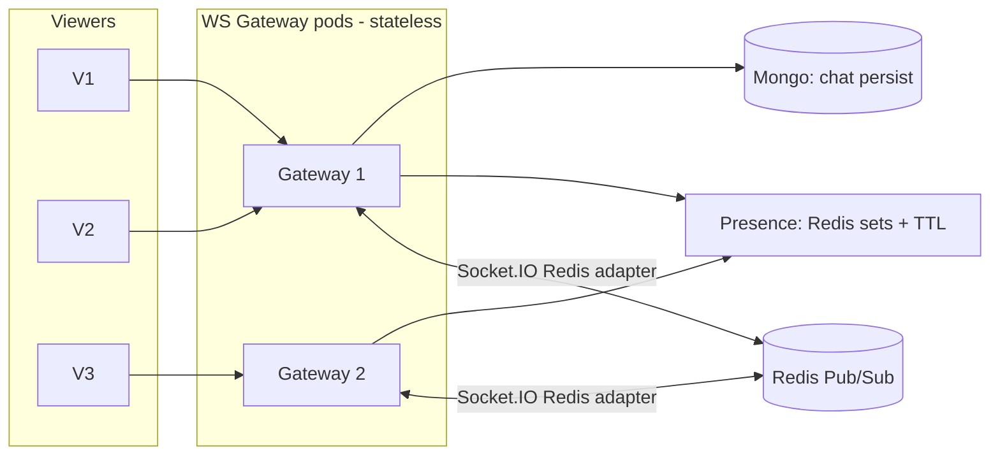

### Components
- **WS Gateway:** Socket.IO pods behind ALB with **sticky sessions** (ALB cookie). The **`@socket.io/redis-adapter`** broadcasts room events across pods so a viewer on G1 receives messages published from G2.
- **Redis Pub/Sub channels:** `room:{id}:chat`, `room:{id}:reactions`, `room:{id}:presence`. Gateways subscribe per active room.
- **Presence tracking:** `SADD room:{id}:viewers {socketId}` with per-member TTL refreshed by heartbeat; `SCARD` for live count. On disconnect, `SREM`. Periodic reconciliation sweep removes stale members.
- **Chat scaling:** persist → publish → fanout. At high volume, **batch** outbound emits (flush every 100–250ms) and **cap** per-room message rate; drop/coalesce under backpressure.
- **Reaction fanout:** never persist per-tap. Client → gateway → `PUBLISH reactions` → gateways **batch + aggregate** counts over a 100–250ms window → single emit. Persist only 10s rollups (see `reactions` collection).

> This is the natural evolution of your current `notifyViewerStateChange` stub and `io` broadcast — formalized into dedicated channels with a Redis backplane so it survives horizontal scaling.

---

## 9. Recording Architecture

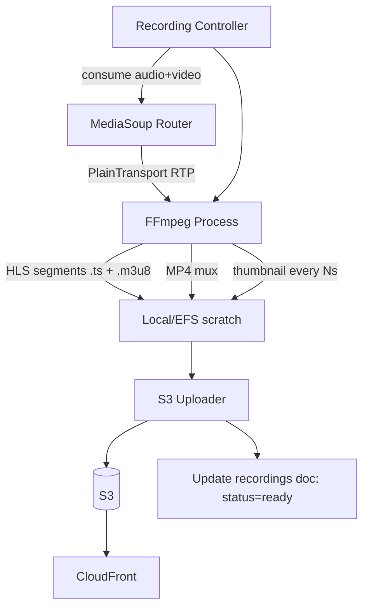

### Pipeline
1. **Controller** spawns a recording worker per stream; creates a **`PlainTransport`** on the router and `consume`s the broadcaster's audio+video producers (RTP, not WebRTC — no DTLS needed server-internal).
2. RTP is piped (via SDP) into **FFmpeg**, which:
   - Muxes to **MP4** (download/archive).
   - Segments to **HLS / LL-HLS** (`.m3u8` + `.ts`) for VOD playback.
   - Extracts **thumbnails** (`-vf fps=1/10` → every 10s, plus a poster frame).
3. **Uploader** streams segments to **S3** as they're written (don't wait for stream end); writes playlist last.
4. On finish: update `recordings` doc to `ready`, expose `hlsPlaylistUrl` via CloudFront.

### Worker placement & scaling
- Recording is **CPU + disk I/O bound** (FFmpeg) — run on **compute-optimized EC2**, isolated from SFU nodes so transcoding spikes don't starve live media.
- 1 worker per active recording; autoscale the recording ASG on `# active recordings`.
- Use **EFS or instance store** for scratch; upload-and-delete to bound disk.

---

## 10. Security Architecture

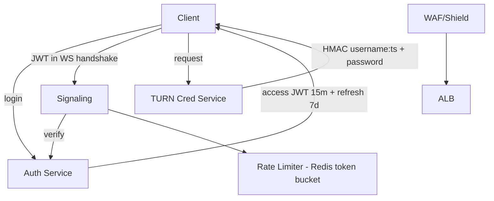

| Layer | Mechanism |
|---|---|
| **Auth** | Short-lived **access JWT (~15m)** + **refresh token (~7d, rotating, hashed in DB)**. JWT passed in Socket.IO handshake `auth` and verified before any signaling. |
| **TURN credentials** | **Time-limited HMAC** creds (coturn `use-auth-secret`): `username = expiryTs:userId`, `password = base64(HMAC-SHA1(secret, username))`. Never ship static TURN passwords. |
| **Rate limiting** | Redis **token-bucket** per user/IP on chat, reactions, join, transport-create. Reject + backoff. |
| **DDoS** | **AWS Shield + WAF** (rate rules, geo/IP reputation) in front of ALB; NLB + Coturn allocation quotas for the media plane. |
| **Abuse prevention** | Per-room participant caps, produce caps (max producers/user), co-host approval gate, ban list checked at join. |
| **Moderation** | Profanity/spam filter on chat ingest → `ModerationEvent`; moderator actions (mute/ban/delete) fan out via Redis so all gateways enforce instantly. |
| **Transport security** | WSS/HTTPS everywhere (DTLS-SRTP is mandatory in WebRTC already); secrets in AWS Secrets Manager; de-hardcode IPs/keys from `transport.ts`. |

---

## 11. Monitoring Architecture

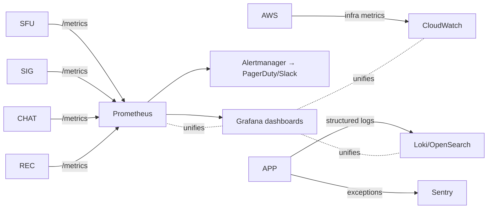

| Signal | Source | Key metrics |
|---|---|---|
| **Media quality** | MediaSoup `getStats()` per transport/consumer | bitrate, jitter, **packet loss %**, RTT, NACK/PLI count, score |
| **SFU health** | Workers | per-worker CPU, # routers, # consumers, port usage |
| **Signaling** | Socket.IO | active WS connections, msg rate, handshake errors, auth failures |
| **Realtime** | Chat/reaction GW | publish rate, fanout latency, backpressure drops |
| **Infra** | CloudWatch | EC2 CPU/NIC, ALB/NLB target health, Redis CPU/evictions, ASG capacity |
| **Errors** | Sentry | exception rate, release-tagged regressions |
| **Logs** | Winston → Loki/OpenSearch | structured JSON, correlation by `roomId`/`socketId` |

> You already emit Winston logs (`logs/error.log`, `logs/combined.log`) and have `sendMetrics.ts` scaffolding — ship logs to Loki/OpenSearch and wire `getStats()` into a Prometheus exporter. **Packet loss > 2–3% sustained** and **RTT > 250ms** are the alerts that correlate with viewer pain.

---

## 12. CI/CD Architecture

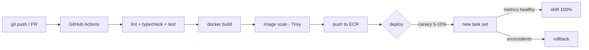

| Stage | Tooling |
|---|---|
| CI | **GitHub Actions**: ESLint + `tsc --noEmit` + tests on PR |
| Build | **Docker** multi-stage; tag with git SHA |
| Registry | **ECR** with image scanning |
| Deploy | ECS rolling / EKS via Argo CD (GitOps) |
| **Canary** | ECS **CodeDeploy blue/green** or EKS Argo Rollouts — shift 5–10% traffic, watch error rate + p99 latency, auto-promote |
| **Rollback** | Keep previous task def / image; one-click (or automated on alarm) revert |

> **Special care for SFU deploys:** never hard-kill a node with live streams. Use **connection draining** — mark node `cordoned`, route new rooms elsewhere, wait for active streams to end (or hit a max drain timeout), then replace. Stateful media can't blue/green like stateless pods.

---

## 13. Disaster Recovery

| Concern | Strategy |
|---|---|
| **Multi-AZ** | ALB/NLB, ASGs, ElastiCache, Atlas all span ≥2 AZs. App tier is stateless → AZ loss = capacity dip, not outage. |
| **DB backups** | Mongo Atlas continuous backups + PITR; daily snapshot retention. S3 versioning + lifecycle to Glacier. |
| **SFU failover** | Media is **inherently non-durable** — a node loss drops *those* live streams. Clients auto-reconnect (your `autoRecovery.ts` scaffolding) and the Coordinator re-places the room on a healthy node; broadcaster re-produces. RTO seconds, no media replay. |
| **Redis failover** | ElastiCache cluster-mode with replicas + automatic failover; presence/pubsub rebuild on reconnect. |
| **Regional outage** | Route53 **health-check failover** to a warm standby region; Atlas global cluster or cross-region replica; S3 cross-region replication for VOD. Full active-active is a large-scale-only investment. |
| **DR tiers** | MVP: single region, multi-AZ, backups. Scale: multi-region warm standby. |

---

## 14. Cost Analysis

Rough **monthly** AWS estimates (us-east-1, on-demand-ish; egress dominates). Assumes avg viewer 720p ~1.5 Mbps, modest concurrent peaks, ~3–4h/day active.

| Concurrent viewers | Compute (SFU+app) | Egress (data transfer) | Data (Redis+Atlas+S3) | Monitoring | **Est. total / mo** |
|---|---|---|---|---|---|
| **100** | 1 SFU + small app (~$200) | ~$150 | ~$100 | ~$50 | **~$500** |
| **1,000** | 1–2 SFU c5n + app (~$700) | ~$1.5k | ~$300 | ~$150 | **~$2.6k** |
| **10,000** | 5–6 SFU nodes + app (~$3k) | **~$12–18k** | ~$800 | ~$400 | **~$17–22k** |
| **100,000 (pure WebRTC)** | 40+ SFU nodes (~$25k) | **~$120–180k** | ~$3k | ~$1.5k | **~$150k–210k** |
| **100,000 (HLS hybrid)** | small WebRTC tier + transcode (~$8k) | **CloudFront ~$40–60k** | ~$3k | ~$1.5k | **~$55–75k** |

**Takeaways:**
- **Egress is 70–90% of cost** at scale. Optimize codecs (consider VP9/AV1 SVC), simulcast layers, and HLS offload.
- The **HLS hybrid cuts 100k cost by ~3×**. This is the single biggest cost lever.
- Reserved Instances / Savings Plans cut compute 30–50% once load is predictable.
- Use **CloudFront** for all VOD; never serve recordings from EC2.

---

## 15. Final Recommended Architecture

### MVP (startup, <1k concurrent) — *ship this next*
- **Single region, multi-AZ.** ECS Fargate for API/signaling/chat; **1–2 EC2 SFU nodes** (host networking); **Coturn on EC2** behind NLB.
- ElastiCache Redis (presence + Socket.IO adapter), MongoDB Atlas M10/M20, S3 + CloudFront for recordings.
- **Close the 5 critical gaps first:** TURN, env-var the announced IP, JWT auth, Redis-backed sticky signaling, disconnect cleanup (already present — keep it).
- Recording via single FFmpeg worker. Monitoring: CloudWatch + a small Prometheus/Grafana.
- **Goal: correctness, NAT traversal, auth, observability.** Don't build cascade/HLS yet.

### Growth (1k–10k concurrent)
- Move SFU to **multi-node with `pipeToRouter` fanout**; Room Coordinator does placement.
- Signaling/chat horizontally scaled with Redis adapter; **separate realtime tier**.
- Start **EKS** migration for app tier; SFU/Coturn stay EC2.
- Canary deploys (CodeDeploy/Argo Rollouts), full Prometheus + Grafana + Sentry, RI/Savings Plans.

### Large scale (10k–100k+)
- **Hybrid delivery:** WebRTC interactive tier + **LL-HLS via CloudFront** for the long tail (the decisive cost/scale move).
- **EKS multi-node-pool**, multi-region warm standby, Route53 failover.
- SFU cascade trees, regional edge SFUs, aggressive simulcast/SVC.
- Dedicated recording/transcode fleet, full DR runbooks.

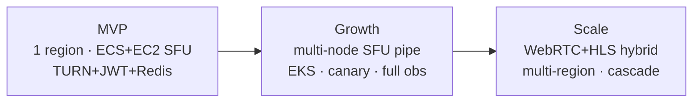

### Headline engineering tradeoffs
- **SFU vs HLS:** SFU = sub-second latency, linear cost. HLS = 2–6s latency, near-flat cost at scale. **Use both** — segment the audience by interactivity need.
- **ECS vs EKS:** ECS faster to ship; EKS needed for scheduling/multi-region. Migrate at the growth boundary.
- **Stateful media:** the whole architecture bends around the fact that **RTP can't be load-balanced or migrated**. Place rooms deliberately; drain, don't kill.
- **Egress is the budget.** Every scaling decision is really a bandwidth-cost decision.

---

## 16. Production Readiness Checklist

### Blockers (do before any real traffic)
- [ ] Deploy **Coturn** (STUN+TURN), wire `iceServers` into the client `Device`
- [ ] Replace hardcoded `announcedIp: 13.232.120.1` with `process.env.ANNOUNCED_IP` (`transport.ts`)
- [ ] Enable **TCP fallback** (`enableTcp: true`) for restrictive networks
- [ ] **JWT auth** on the Socket.IO handshake; reject unauthenticated signaling
- [ ] Restrict **CORS** from `*` to known origins
- [ ] **Multi-worker** MediaSoup (1 per vCPU), not single worker
- [ ] **Redis adapter + sticky sessions** so signaling can run >1 pod

### Reliability
- [ ] Room→node placement map in Redis (Coordinator)
- [ ] Graceful **drain** on SFU deploy/scale-in
- [ ] Disconnect cleanup verified (exists — `disconnect.handlers.ts`) + zombie transport TTL sweep
- [ ] Health checks for ALB/NLB targets; readiness vs liveness split
- [ ] Persist stream/session lifecycle to Mongo (models exist, wire them up)

### Security
- [ ] Refresh-token rotation + hashed storage
- [ ] Time-limited HMAC TURN credentials
- [ ] Redis token-bucket rate limits (chat/reactions/join/produce)
- [ ] WAF + Shield on ALB; secrets in Secrets Manager
- [ ] Moderation pipeline + ban enforcement at join

### Observability
- [ ] Prometheus exporter for MediaSoup `getStats()` (packet loss, RTT, bitrate)
- [ ] Grafana dashboards (media quality, SFU load, signaling)
- [ ] Ship Winston logs to Loki/OpenSearch; Sentry for exceptions
- [ ] Alerts: packet loss >2–3%, RTT >250ms, worker CPU >80%, port exhaustion

### Delivery & DR
- [ ] GitHub Actions CI (lint/typecheck/test) + ECR + image scan
- [ ] Canary/blue-green for stateless tiers; drain strategy for SFU
- [ ] Atlas PITR + S3 versioning; documented RTO/RPO
- [ ] Recording → FFmpeg → S3 → CloudFront pipeline with thumbnails

---

*Document scope: architecture & evolution plan. Implementation of each section (TURN deploy, multi-worker refactor, auth, recording pipeline) can be tracked as separate workstreams.*
