<div class="cover">

<div class="cover-kicker">PRODUCTION READINESS PLAN</div>

# CrowdStream

## From Prototype to Production in 7 Weeks

<div class="cover-sub">Target architecture, scalability strategy, and a day-by-day execution roadmap for taking the CrowdStream WebRTC / MediaSoup live-streaming platform to an MVP-grade, production-ready system.</div>

<div class="cover-meta">
<strong>Document version:</strong> 1.0<br/>
<strong>Date:</strong> 2026-06-17<br/>
<strong>Scope:</strong> Architecture &amp; 35-working-day execution plan (MVP target)
</div>

</div>

<div class="page-break"></div>

# How to Read This Document

This document is the single source of truth for taking **CrowdStream** to production. It is organised in three parts:

- **Part I — Target Production Architecture.** The production-scale architecture the system is evolving toward: high-level topology, WebRTC media flow, AWS infrastructure, scalability tiers, data model, security, observability, CI/CD, disaster recovery, cost, and the Production Readiness Checklist.
- **Part II — The 7-Week Production Roadmap.** A day-by-day execution plan (5 working days × 7 weeks = 35 days) that operationalises Part I, closing the production blockers in dependency order. Each day carries a goal, a task checklist, and acceptance criteria.
- **Appendix A — Current System Architecture.** The system *as built today*, the baseline the roadmap starts from.

**The throughline:** Part I §16 (the Production Readiness Checklist) defines *what* "done" means; Part II sequences *when* each item gets done; Appendix A describes *where we start*.

<div class="callout">
<strong>Definition of done (MVP).</strong> By the end of Week 7 the system satisfies the MVP target in Part I §15: single region, multi-AZ, TURN + JWT + Redis-backed signaling, durable lifecycle, chat / reactions / presence, a working recording pipeline, and baseline observability + CI/CD.
</div>

<div class="page-break"></div>

# Part I — Target Production Architecture

> Principal Distributed Systems Architecture for a WebRTC/MediaSoup live-streaming platform.
> This document evolves the **current** single-process signaling server into a production-scale system, then defines the MVP → growth → large-scale path.

---

### 0. Where We Are Today (Baseline)

Grounded in the current `backend/src`:

| Component | Current State | File |
|---|---|---|
| Signaling | Single-process **Socket.IO** server, port `3000`, CORS `*` | `index.ts`, `utils/socket.util.ts` |
| MediaSoup worker | **1 worker per process**, UDP `40000–49999` | `mediasoup/worker.ts` |
| Router | **1 router per room**, codecs Opus / VP8 / H.264 | `mediasoup/router.ts` |
| Transport | UDP-only, **hardcoded `announcedIp: 13.232.120.1`**, no TURN | `mediasoup/transport.ts` |
| Room store | **In-memory `Map`**, ephemeral, no persistence | `rooms/room.store.ts` |
| DB models | 5 Mongoose schemas defined but **not actively persisted** live | `models/*.ts` |
| Recording | **None** (FFmpeg not integrated) | — |
| Auth | **None** (no JWT, open WS) | — |

#### Critical gaps to close for production
1. **No TURN/STUN** → clients behind symmetric NAT cannot connect. **Highest-impact blocker.**
2. **Single worker** → caps at ~1 CPU core of media (~500 consumers).
3. **Hardcoded IP** → cannot scale horizontally or multi-region.
4. **In-memory rooms** → no failover; a crash drops every live stream.
5. **No auth / rate limiting** → open to abuse and resource exhaustion.
6. **Stateful signaling** → cannot load-balance Socket.IO without sticky sessions + Redis adapter.

---

### Table of Contents
1. [High-Level Architecture](#1-high-level-architecture)
2. [Detailed Component Diagram (C4)](#2-detailed-component-diagram-c4)
3. [WebRTC Media Flow](#3-webrtc-media-flow)
4. [Data Flow](#4-data-flow)
5. [AWS Production Infrastructure](#5-aws-production-infrastructure)
6. [Scalability Plan](#6-scalability-plan)
7. [Database Design](#7-database-design)
8. [Real-Time Messaging Architecture](#8-real-time-messaging-architecture)
9. [Recording Architecture](#9-recording-architecture)
10. [Security Architecture](#10-security-architecture)
11. [Monitoring Architecture](#11-monitoring-architecture)
12. [CI/CD Architecture](#12-cicd-architecture)
13. [Disaster Recovery](#13-disaster-recovery)
14. [Cost Analysis](#14-cost-analysis)
15. [Final Recommended Architecture](#15-final-recommended-architecture)
16. [Production Readiness Checklist](#16-production-readiness-checklist)

---

### 1. High-Level Architecture

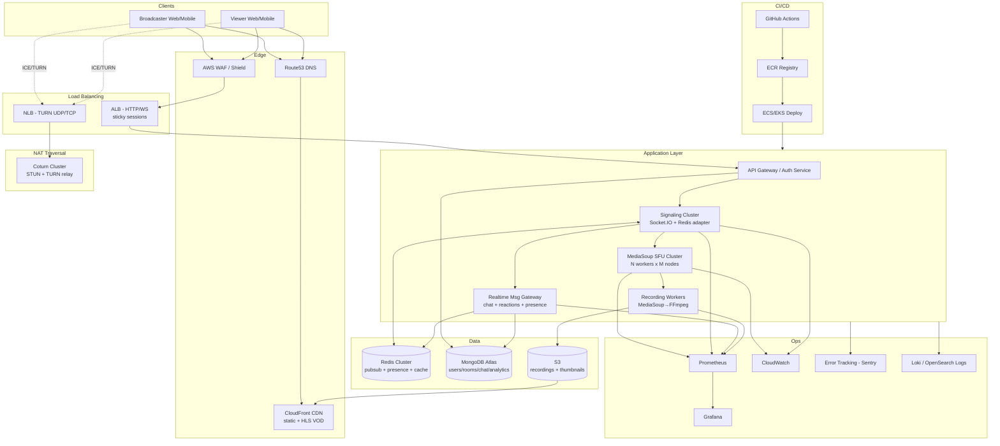

**Key separation of planes:**
- **Control plane** (signaling, chat, presence) → ALB + Socket.IO + Redis. Cheap, scales horizontally.
- **Media plane** (RTP) → MediaSoup SFU + Coturn. Expensive (bandwidth + CPU), scales vertically per worker then horizontally per node.
- **Storage/delivery plane** (VOD) → S3 + CloudFront. Decoupled from live path.

The single most important architectural principle: **never route media through the signaling tier**. Signaling carries only SDP/ICE/control JSON; RTP flows client ↔ MediaSoup directly (or via TURN relay).

---

### 2. Detailed Component Diagram (C4)

#### C4 — Container Level

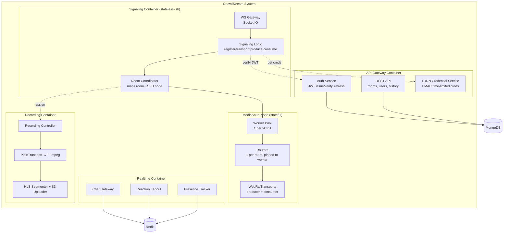

#### Service boundaries & horizontal scaling strategy

| Service | State | Scale unit | Scaling trigger | Notes |
|---|---|---|---|---|
| Auth / REST API | Stateless | Pods behind ALB | CPU / RPS | Trivially horizontal |
| Signaling (Socket.IO) | Soft state (socket↔room) | Pods + **Redis adapter** + **sticky sessions** | WS connection count | Sticky needed; Redis adapter for cross-pod events |
| MediaSoup SFU | **Hard state** (RTP pinned to worker) | **Node** (vertical first: 1 worker/vCPU) | Worker CPU / consumer count | Cannot move a live router; route new rooms to least-loaded node |
| Realtime (chat/reactions) | Soft state | Pods + Redis Pub/Sub | Message throughput | Fanout via Redis channels |
| Recording | Stateful per-recording | 1 worker per active recording | # concurrent recordings | CPU + disk I/O bound (FFmpeg) |
| Coturn | Stateless relay | Nodes behind NLB | Relayed bandwidth | Bandwidth-bound, not CPU |

**The hard rule for MediaSoup:** a router is pinned to a worker, a worker is pinned to a node. You scale by **placing new rooms** on the least-loaded worker/node — never by migrating live media. The Room Coordinator (`ROOMSVC`) owns this placement decision and persists `room → node` mapping in Redis so signaling pods agree on where a room lives.

---

### 3. WebRTC Media Flow

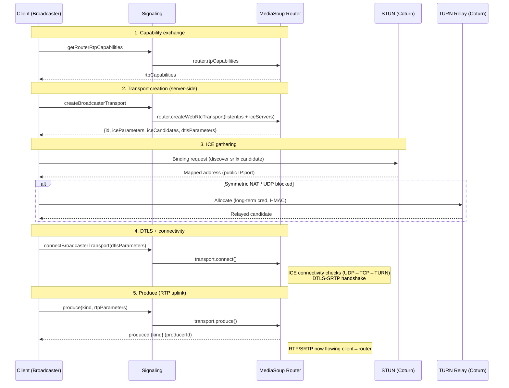

#### Consumer (viewer) path

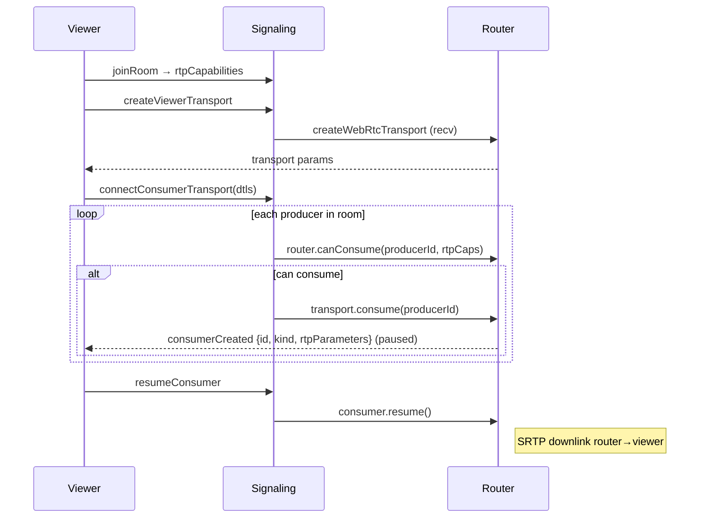

> **Note:** Consumers are created **paused** and resumed after the client wires up the track — this avoids losing the first keyframe. This matches the `consume` → `resumeConsumer` flow already in `registerViewer.handler.ts`.

#### Transport lifecycle
`create → connect (DTLS) → produce/consume → pause/resume → close (on disconnect)`. Cleanup on disconnect already exists in `disconnect.handlers.ts` (`cleanupViewer`, `cleanUpBroadcaster`) — production-correct; keep it and add a TTL sweep for zombie transports.

#### ICE server config to add (`transport.ts`)
```ts
const transport = await router.createWebRtcTransport({
  listenIps: [{ ip: "0.0.0.0", announcedIp: process.env.ANNOUNCED_IP }], // de-hardcode
  enableUdp: true,
  enableTcp: true,   // enable TCP fallback (currently false)
  preferUdp: true,
  initialAvailableOutgoingBitrate: 1_000_000,
});
// iceServers (STUN/TURN) are supplied to the CLIENT, not the server transport:
// client passes them into the RTCPeerConnection / mediasoup-client Device.
```

---

### 4. Data Flow

#### 4a. Broadcaster starts stream
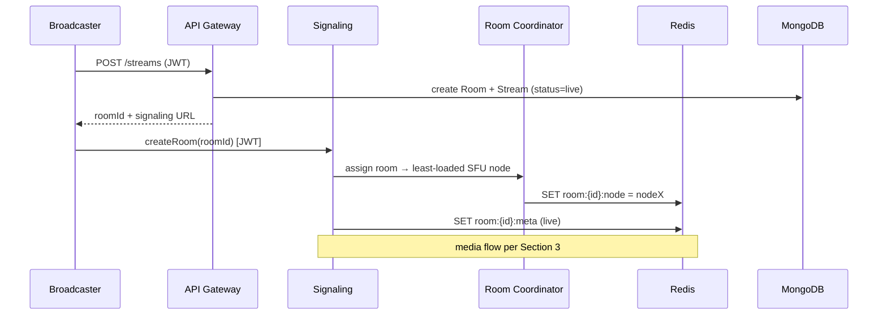

#### 4b. Viewer joins & subscribes
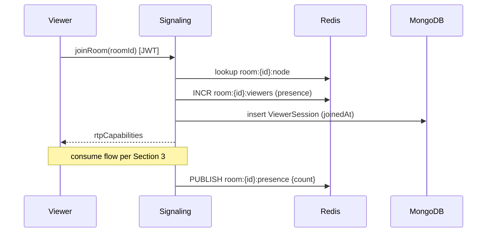

#### 4c. Reaction fanout
```mermaid
sequenceDiagram
    participant V as Viewer
    participant CHAT as Realtime GW
    participant R as Redis PubSub
    participant OTHERS as All viewers
    V->>CHAT: reaction {emoji} [rate-limited]
    CHAT->>R: PUBLISH room:{id}:reactions {emoji,ts}
    R-->>CHAT: fanout to subscribed gateways
    CHAT-->>OTHERS: emit reaction (batched 100–250ms)
    Note over CHAT: NOT persisted individually;<br/>aggregated counts → analytics
```

#### 4d. Chat message
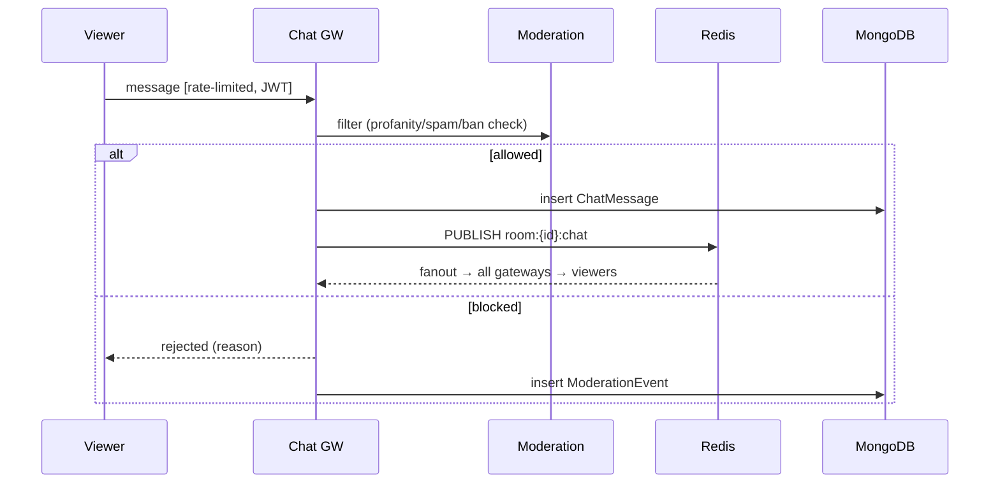

#### 4e. Recording starts
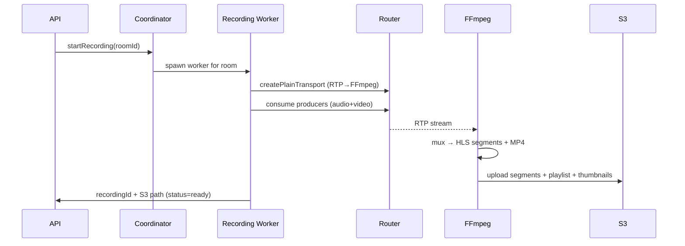

---

### 5. AWS Production Infrastructure

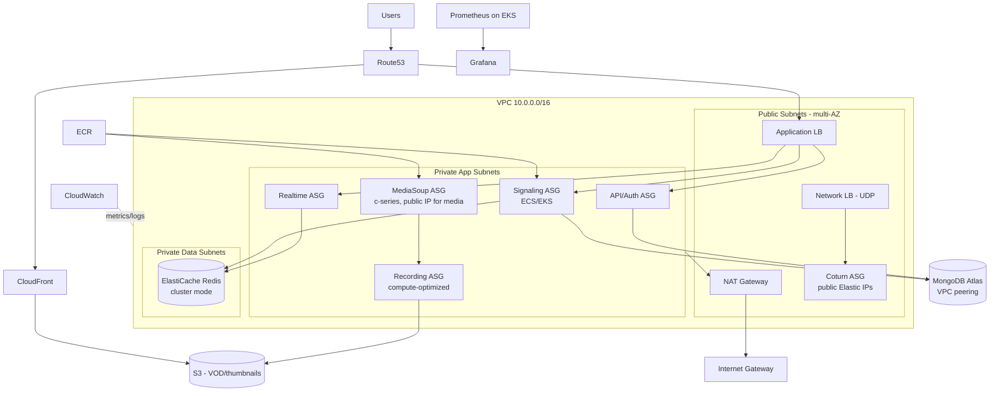

#### Networking & placement notes
- **MediaSoup nodes need public IPs** (or Elastic IPs) because `announcedIp` must be reachable for ICE. They sit in private subnets but with a public IP / EIP per node — this is the one exception to "app tier is fully private." Lock down via Security Groups (only UDP `40000–49999` + TURN).
- **Coturn** runs in public subnets behind an **NLB** (UDP/TCP passthrough; ALB cannot do UDP).
- **Redis** and **Mongo Atlas** (via VPC peering) live in private data subnets — no public access.
- **Security Groups:**
  - ALB SG: `443/80` from `0.0.0.0/0`.
  - SFU SG: UDP `40000–49999` + TCP fallback from `0.0.0.0/0`; signaling control port only from ALB/signaling SG.
  - Redis SG: `6379` only from app SGs.

#### ECS vs Kubernetes recommendation

| Stage | Recommendation | Why |
|---|---|---|
| MVP | **ECS Fargate** for API/signaling/chat; **EC2 (not Fargate)** for MediaSoup & Coturn | Fargate can't expose the wide UDP port range MediaSoup needs; SFU must be EC2 with host networking |
| Growth | **ECS on EC2** capacity providers, or start EKS | Manage SFU placement with EC2 + custom ASG |
| Large scale | **EKS (Kubernetes)** | Need advanced scheduling, multi-region, GitOps, node pools per workload class |

> **Recommendation: start ECS, graduate to EKS at the growth→scale boundary.** Run MediaSoup and Coturn on **EC2 with host networking** regardless of orchestrator — the UDP port range and public-IP requirement make Fargate unsuitable for the media plane.

---

### 6. Scalability Plan

#### Per-worker math
A MediaSoup worker = 1 CPU core, sustains roughly **500 consumers** of 720p (~1.5 Mbps) before CPU/encryption saturates. Bandwidth is usually the real wall first:
- 1 viewer @ 720p ≈ **1.5 Mbps** down.
- 10k viewers ≈ **15 Gbps** egress — this is the dominant cost and constraint, not CPU.

#### Scaling tiers

| Viewers | Topology | Workers / Nodes | Primary bottleneck | Mitigation |
|---|---|---|---|---|
| **100** | Single SFU node, 1–2 workers | 1 node (4 vCPU) | None | Just add TURN + auth |
| **1,000** | Single beefy SFU node | 4–8 workers, 1 node | Node NIC (~1.5 Gbps) | c5n.2xlarge (up to 25 Gbps NIC) |
| **10,000** | **Multi-node SFU + piping** | ~20 workers across 4–6 nodes | Egress bandwidth (~15 Gbps), worker CPU | **Pipe producers** across routers/nodes (fanout tree); add nodes horizontally |
| **100,000** | **SFU cascade + HLS hybrid** | 40+ nodes OR switch most viewers to HLS/CDN | Cost & bandwidth explode | **Hybrid: WebRTC for low-latency tier, HLS via CloudFront for the long tail** |

#### The 100k insight — hybrid delivery
Pure WebRTC SFU to 100k viewers is economically irrational (you pay AWS egress for every bit, ~$0.05–0.08/GB). At that scale:
- Keep **WebRTC** for the interactive tier (co-hosts, first few thousand low-latency viewers).
- **Transcode once to HLS/LL-HLS** (the FFmpeg pipeline you already need for recording) and serve the massive passive audience through **CloudFront** at ~$0.02/GB with edge caching. Latency rises to 2–6s (LL-HLS ~2s) but cost drops 10×+ and it scales effectively infinitely.

#### SFU fan-out (10k tier)
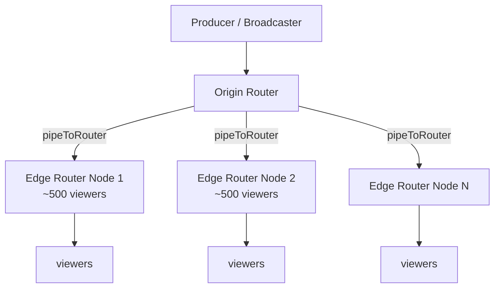
MediaSoup's `pipeToRouter` relays one producer to other routers/nodes; each edge router serves ~500 local consumers. This turns a flat SFU into a distribution tree.

#### Bottleneck summary
- **Network:** egress bandwidth is the #1 constraint and cost driver. NIC caps (~25 Gbps on c5n) bound per-node viewer count.
- **CPU:** SRTP encryption per consumer; ~500 consumers/core.
- **MediaSoup workers:** 1 per vCPU, hard ceiling; scale by adding workers/nodes, never by overloading one.
- **Signaling:** Socket.IO connection count per pod (~10–30k WS/pod with tuning); scale pods + Redis adapter.

---

### 7. Database Design

MongoDB (Atlas) for flexible documents; Redis for hot ephemeral state. Schemas below extend your existing `models/`.

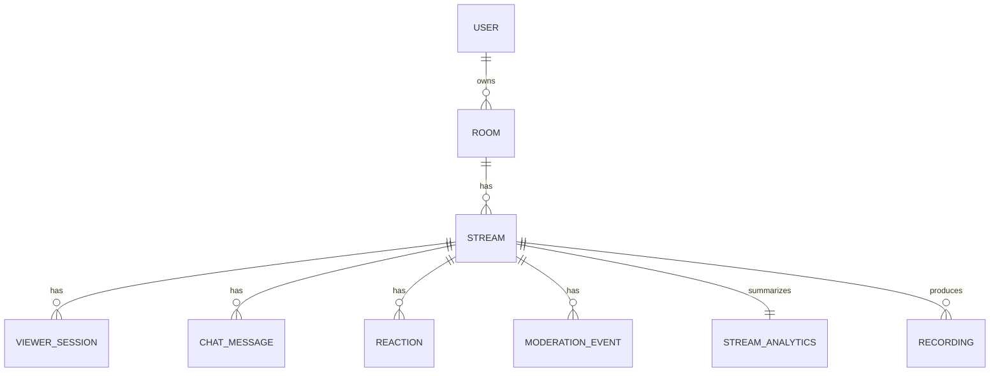

#### Collections

**users**
```js
{ _id, username, email, passwordHash, displayName, avatarUrl,
  roles: ["user"|"broadcaster"|"admin"|"moderator"],
  refreshTokenHash, banned: Boolean, createdAt, updatedAt }
// idx: { email:1 } unique, { username:1 } unique
```

**rooms** (persistent room/channel)
```js
{ _id, ownerId→users, title, slug, visibility: "public"|"private"|"unlisted",
  status: "idle"|"live"|"ended", currentStreamId, createdAt }
// idx: { ownerId:1 }, { slug:1 } unique, { status:1 }
```

**streams** (one live session)
```js
{ _id, roomId→rooms, hostUserId→users, status: "live"|"ended",
  sfuNodeId, startedAt, endedAt, peakViewers, recordingId, createdAt }
// idx: { roomId:1, startedAt:-1 }, { status:1, sfuNodeId:1 }
```

**viewer_sessions** (extends your `viewer.model.ts`)
```js
{ _id, streamId→streams, userId→users, socketId,
  joinedAt, leftAt, watchDurationSec, role: "viewer"|"co-host",
  clientInfo:{ ua, ip(hashed), country } }
// idx: { streamId:1 }, { userId:1, joinedAt:-1 }
// TTL or archive to cold storage after N days
```

**chat_messages**
```js
{ _id, streamId→streams, userId→users, username, text,
  createdAt, deleted: Boolean, deletedBy }
// idx: { streamId:1, createdAt:1 }  // range scan for replay
```

**reactions** (aggregated, not per-tap)
```js
{ _id, streamId→streams, bucketTs (10s bucket), counts:{ "❤️":int, "👍":int, ... } }
// idx: { streamId:1, bucketTs:1 }  // pre-aggregated to avoid write storm
```

**moderation_events**
```js
{ _id, streamId, targetUserId, actorUserId,
  action: "mute"|"ban"|"delete_msg"|"timeout"|"flag",
  reason, createdAt, expiresAt }
// idx: { streamId:1, createdAt:-1 }, { targetUserId:1 }
```

**stream_analytics** (rollup, written on stream end + periodic)
```js
{ _id, streamId→streams, peakViewers, avgViewers, totalUniqueViewers,
  avgWatchDurationSec, totalReactions, totalMessages,
  avgBitrate, avgPacketLossPct, avgRttMs, region, computedAt }
// idx: { streamId:1 } unique
```

**recordings**
```js
{ _id, streamId→streams, status: "recording"|"processing"|"ready"|"failed",
  s3Key, hlsPlaylistUrl, mp4Url, thumbnailUrls:[], durationSec,
  sizeBytes, createdAt, readyAt }
// idx: { streamId:1 }
```

#### Polyglot persistence rationale
- **MongoDB:** durable entities, history, analytics.
- **Redis:** live presence (`room:{id}:viewers`), `room→node` map, pub/sub channels, rate-limit counters, session cache. Sub-ms, ephemeral.
- **S3:** recordings, thumbnails, HLS segments.
- **Write-storm avoidance:** reactions are bucket-aggregated; chat is the only high-frequency persisted write — shard by `streamId` and consider time-series collections for very high volume.

---

### 8. Real-Time Messaging Architecture

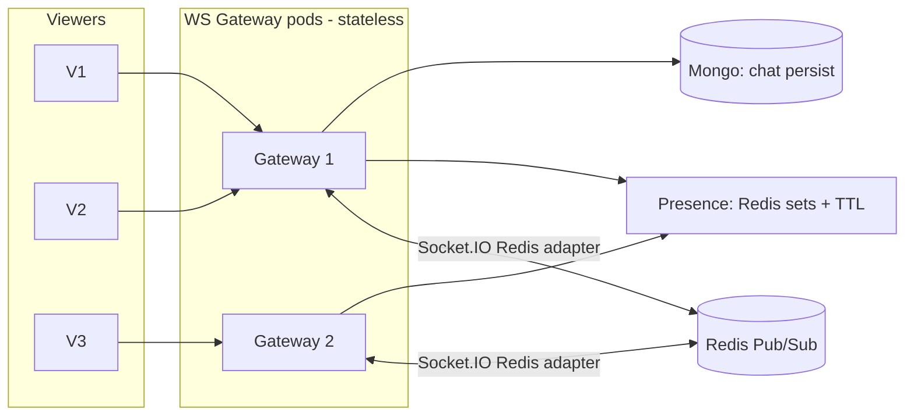

#### Components
- **WS Gateway:** Socket.IO pods behind ALB with **sticky sessions** (ALB cookie). The **`@socket.io/redis-adapter`** broadcasts room events across pods so a viewer on G1 receives messages published from G2.
- **Redis Pub/Sub channels:** `room:{id}:chat`, `room:{id}:reactions`, `room:{id}:presence`. Gateways subscribe per active room.
- **Presence tracking:** `SADD room:{id}:viewers {socketId}` with per-member TTL refreshed by heartbeat; `SCARD` for live count. On disconnect, `SREM`. Periodic reconciliation sweep removes stale members.
- **Chat scaling:** persist → publish → fanout. At high volume, **batch** outbound emits (flush every 100–250ms) and **cap** per-room message rate; drop/coalesce under backpressure.
- **Reaction fanout:** never persist per-tap. Client → gateway → `PUBLISH reactions` → gateways **batch + aggregate** counts over a 100–250ms window → single emit. Persist only 10s rollups (see `reactions` collection).

> This is the natural evolution of your current `notifyViewerStateChange` stub and `io` broadcast — formalized into dedicated channels with a Redis backplane so it survives horizontal scaling.

---

### 9. Recording Architecture

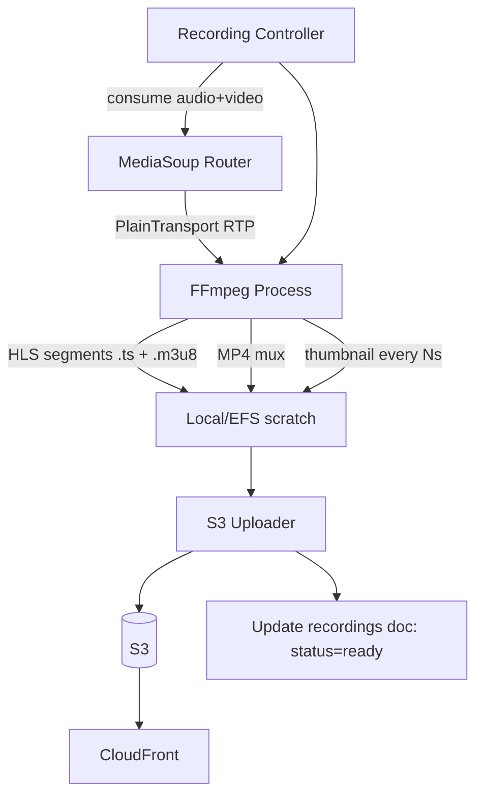

#### Pipeline
1. **Controller** spawns a recording worker per stream; creates a **`PlainTransport`** on the router and `consume`s the broadcaster's audio+video producers (RTP, not WebRTC — no DTLS needed server-internal).
2. RTP is piped (via SDP) into **FFmpeg**, which:
   - Muxes to **MP4** (download/archive).
   - Segments to **HLS / LL-HLS** (`.m3u8` + `.ts`) for VOD playback.
   - Extracts **thumbnails** (`-vf fps=1/10` → every 10s, plus a poster frame).
3. **Uploader** streams segments to **S3** as they're written (don't wait for stream end); writes playlist last.
4. On finish: update `recordings` doc to `ready`, expose `hlsPlaylistUrl` via CloudFront.

#### Worker placement & scaling
- Recording is **CPU + disk I/O bound** (FFmpeg) — run on **compute-optimized EC2**, isolated from SFU nodes so transcoding spikes don't starve live media.
- 1 worker per active recording; autoscale the recording ASG on `# active recordings`.
- Use **EFS or instance store** for scratch; upload-and-delete to bound disk.

---

### 10. Security Architecture

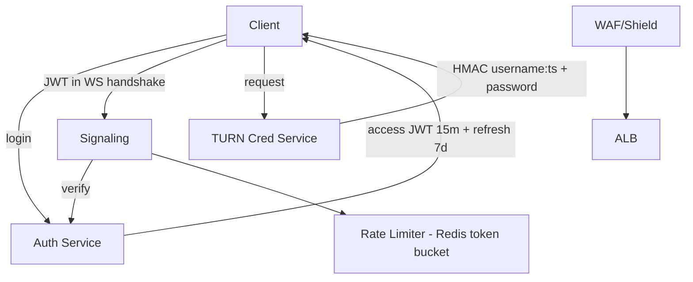

| Layer | Mechanism |
|---|---|
| **Auth** | Short-lived **access JWT (~15m)** + **refresh token (~7d, rotating, hashed in DB)**. JWT passed in Socket.IO handshake `auth` and verified before any signaling. |
| **TURN credentials** | **Time-limited HMAC** creds (coturn `use-auth-secret`): `username = expiryTs:userId`, `password = base64(HMAC-SHA1(secret, username))`. Never ship static TURN passwords. |
| **Rate limiting** | Redis **token-bucket** per user/IP on chat, reactions, join, transport-create. Reject + backoff. |
| **DDoS** | **AWS Shield + WAF** (rate rules, geo/IP reputation) in front of ALB; NLB + Coturn allocation quotas for the media plane. |
| **Abuse prevention** | Per-room participant caps, produce caps (max producers/user), co-host approval gate, ban list checked at join. |
| **Moderation** | Profanity/spam filter on chat ingest → `ModerationEvent`; moderator actions (mute/ban/delete) fan out via Redis so all gateways enforce instantly. |
| **Transport security** | WSS/HTTPS everywhere (DTLS-SRTP is mandatory in WebRTC already); secrets in AWS Secrets Manager; de-hardcode IPs/keys from `transport.ts`. |

---

### 11. Monitoring Architecture

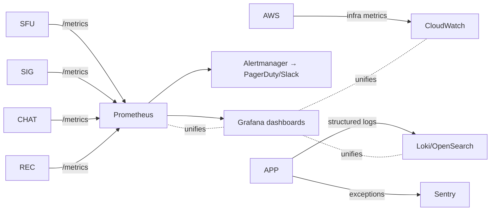

| Signal | Source | Key metrics |
|---|---|---|
| **Media quality** | MediaSoup `getStats()` per transport/consumer | bitrate, jitter, **packet loss %**, RTT, NACK/PLI count, score |
| **SFU health** | Workers | per-worker CPU, # routers, # consumers, port usage |
| **Signaling** | Socket.IO | active WS connections, msg rate, handshake errors, auth failures |
| **Realtime** | Chat/reaction GW | publish rate, fanout latency, backpressure drops |
| **Infra** | CloudWatch | EC2 CPU/NIC, ALB/NLB target health, Redis CPU/evictions, ASG capacity |
| **Errors** | Sentry | exception rate, release-tagged regressions |
| **Logs** | Winston → Loki/OpenSearch | structured JSON, correlation by `roomId`/`socketId` |

> You already emit Winston logs (`logs/error.log`, `logs/combined.log`) and have `sendMetrics.ts` scaffolding — ship logs to Loki/OpenSearch and wire `getStats()` into a Prometheus exporter. **Packet loss > 2–3% sustained** and **RTT > 250ms** are the alerts that correlate with viewer pain.

---

### 12. CI/CD Architecture

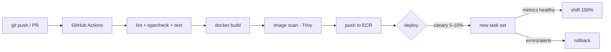

| Stage | Tooling |
|---|---|
| CI | **GitHub Actions**: ESLint + `tsc --noEmit` + tests on PR |
| Build | **Docker** multi-stage; tag with git SHA |
| Registry | **ECR** with image scanning |
| Deploy | ECS rolling / EKS via Argo CD (GitOps) |
| **Canary** | ECS **CodeDeploy blue/green** or EKS Argo Rollouts — shift 5–10% traffic, watch error rate + p99 latency, auto-promote |
| **Rollback** | Keep previous task def / image; one-click (or automated on alarm) revert |

> **Special care for SFU deploys:** never hard-kill a node with live streams. Use **connection draining** — mark node `cordoned`, route new rooms elsewhere, wait for active streams to end (or hit a max drain timeout), then replace. Stateful media can't blue/green like stateless pods.

---

### 13. Disaster Recovery

| Concern | Strategy |
|---|---|
| **Multi-AZ** | ALB/NLB, ASGs, ElastiCache, Atlas all span ≥2 AZs. App tier is stateless → AZ loss = capacity dip, not outage. |
| **DB backups** | Mongo Atlas continuous backups + PITR; daily snapshot retention. S3 versioning + lifecycle to Glacier. |
| **SFU failover** | Media is **inherently non-durable** — a node loss drops *those* live streams. Clients auto-reconnect (your `autoRecovery.ts` scaffolding) and the Coordinator re-places the room on a healthy node; broadcaster re-produces. RTO seconds, no media replay. |
| **Redis failover** | ElastiCache cluster-mode with replicas + automatic failover; presence/pubsub rebuild on reconnect. |
| **Regional outage** | Route53 **health-check failover** to a warm standby region; Atlas global cluster or cross-region replica; S3 cross-region replication for VOD. Full active-active is a large-scale-only investment. |
| **DR tiers** | MVP: single region, multi-AZ, backups. Scale: multi-region warm standby. |

---

### 14. Cost Analysis

Rough **monthly** AWS estimates (us-east-1, on-demand-ish; egress dominates). Assumes avg viewer 720p ~1.5 Mbps, modest concurrent peaks, ~3–4h/day active.

| Concurrent viewers | Compute (SFU+app) | Egress (data transfer) | Data (Redis+Atlas+S3) | Monitoring | **Est. total / mo** |
|---|---|---|---|---|---|
| **100** | 1 SFU + small app (~$200) | ~$150 | ~$100 | ~$50 | **~$500** |
| **1,000** | 1–2 SFU c5n + app (~$700) | ~$1.5k | ~$300 | ~$150 | **~$2.6k** |
| **10,000** | 5–6 SFU nodes + app (~$3k) | **~$12–18k** | ~$800 | ~$400 | **~$17–22k** |
| **100,000 (pure WebRTC)** | 40+ SFU nodes (~$25k) | **~$120–180k** | ~$3k | ~$1.5k | **~$150k–210k** |
| **100,000 (HLS hybrid)** | small WebRTC tier + transcode (~$8k) | **CloudFront ~$40–60k** | ~$3k | ~$1.5k | **~$55–75k** |

**Takeaways:**
- **Egress is 70–90% of cost** at scale. Optimize codecs (consider VP9/AV1 SVC), simulcast layers, and HLS offload.
- The **HLS hybrid cuts 100k cost by ~3×**. This is the single biggest cost lever.
- Reserved Instances / Savings Plans cut compute 30–50% once load is predictable.
- Use **CloudFront** for all VOD; never serve recordings from EC2.

---

### 15. Final Recommended Architecture

#### MVP (startup, <1k concurrent) — *ship this next*
- **Single region, multi-AZ.** ECS Fargate for API/signaling/chat; **1–2 EC2 SFU nodes** (host networking); **Coturn on EC2** behind NLB.
- ElastiCache Redis (presence + Socket.IO adapter), MongoDB Atlas M10/M20, S3 + CloudFront for recordings.
- **Close the 5 critical gaps first:** TURN, env-var the announced IP, JWT auth, Redis-backed sticky signaling, disconnect cleanup (already present — keep it).
- Recording via single FFmpeg worker. Monitoring: CloudWatch + a small Prometheus/Grafana.
- **Goal: correctness, NAT traversal, auth, observability.** Don't build cascade/HLS yet.

#### Growth (1k–10k concurrent)
- Move SFU to **multi-node with `pipeToRouter` fanout**; Room Coordinator does placement.
- Signaling/chat horizontally scaled with Redis adapter; **separate realtime tier**.
- Start **EKS** migration for app tier; SFU/Coturn stay EC2.
- Canary deploys (CodeDeploy/Argo Rollouts), full Prometheus + Grafana + Sentry, RI/Savings Plans.

#### Large scale (10k–100k+)
- **Hybrid delivery:** WebRTC interactive tier + **LL-HLS via CloudFront** for the long tail (the decisive cost/scale move).
- **EKS multi-node-pool**, multi-region warm standby, Route53 failover.
- SFU cascade trees, regional edge SFUs, aggressive simulcast/SVC.
- Dedicated recording/transcode fleet, full DR runbooks.

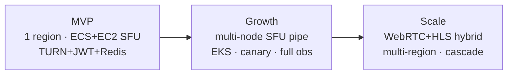

#### Headline engineering tradeoffs
- **SFU vs HLS:** SFU = sub-second latency, linear cost. HLS = 2–6s latency, near-flat cost at scale. **Use both** — segment the audience by interactivity need.
- **ECS vs EKS:** ECS faster to ship; EKS needed for scheduling/multi-region. Migrate at the growth boundary.
- **Stateful media:** the whole architecture bends around the fact that **RTP can't be load-balanced or migrated**. Place rooms deliberately; drain, don't kill.
- **Egress is the budget.** Every scaling decision is really a bandwidth-cost decision.

---

### 16. Production Readiness Checklist

#### Blockers (do before any real traffic)
- [ ] Deploy **Coturn** (STUN+TURN), wire `iceServers` into the client `Device`
- [ ] Replace hardcoded `announcedIp: 13.232.120.1` with `process.env.ANNOUNCED_IP` (`transport.ts`)
- [ ] Enable **TCP fallback** (`enableTcp: true`) for restrictive networks
- [ ] **JWT auth** on the Socket.IO handshake; reject unauthenticated signaling
- [ ] Restrict **CORS** from `*` to known origins
- [ ] **Multi-worker** MediaSoup (1 per vCPU), not single worker
- [ ] **Redis adapter + sticky sessions** so signaling can run >1 pod

#### Reliability
- [ ] Room→node placement map in Redis (Coordinator)
- [ ] Graceful **drain** on SFU deploy/scale-in
- [ ] Disconnect cleanup verified (exists — `disconnect.handlers.ts`) + zombie transport TTL sweep
- [ ] Health checks for ALB/NLB targets; readiness vs liveness split
- [ ] Persist stream/session lifecycle to Mongo (models exist, wire them up)

#### Security
- [ ] Refresh-token rotation + hashed storage
- [ ] Time-limited HMAC TURN credentials
- [ ] Redis token-bucket rate limits (chat/reactions/join/produce)
- [ ] WAF + Shield on ALB; secrets in Secrets Manager
- [ ] Moderation pipeline + ban enforcement at join

#### Observability
- [ ] Prometheus exporter for MediaSoup `getStats()` (packet loss, RTT, bitrate)
- [ ] Grafana dashboards (media quality, SFU load, signaling)
- [ ] Ship Winston logs to Loki/OpenSearch; Sentry for exceptions
- [ ] Alerts: packet loss >2–3%, RTT >250ms, worker CPU >80%, port exhaustion

#### Delivery & DR
- [ ] GitHub Actions CI (lint/typecheck/test) + ECR + image scan
- [ ] Canary/blue-green for stateless tiers; drain strategy for SFU
- [ ] Atlas PITR + S3 versioning; documented RTO/RPO
- [ ] Recording → FFmpeg → S3 → CloudFront pipeline with thumbnails

---

*Document scope: architecture & evolution plan. Implementation of each section (TURN deploy, multi-worker refactor, auth, recording pipeline) can be tracked as separate workstreams.*

<div class="page-break"></div>

# Part II — The 7-Week Production Roadmap

A day-by-day execution plan to take CrowdStream from the current single-process
prototype to an MVP-grade, production-ready live-streaming platform.

This roadmap operationalizes the two architecture docs:
- [`ARCHITECTURE.md`](../../ARCHITECTURE.md) — the **current** system as built.
- [`docs/ARCHITECTURE.md`](../ARCHITECTURE.md) — the **target** production architecture, the MVP plan (§15), and the Production Readiness Checklist (§16).

### How to use this plan

- Each working day has its own folder with a `README.md` containing a **goal**, a **task checklist**, and **acceptance criteria**.
- Work top-to-bottom. Check boxes off as you complete them (`- [x]`).
- At the **end of each week**, open that week's `review.md`, tick what you actually finished, and move anything unfinished into the **Backlog** section so it carries forward.
- 5 working days/week (Mon–Fri). 35 working days total.

### The 7 weeks at a glance

| Week | Theme | Outcome | Closes |
|---|---|---|---|
| [Week 1](week-1/) | **NAT traversal & config** | Clients behind any NAT can connect; no hardcoded IPs | Blockers §16 (TURN, announcedIp, TCP, CORS) |
| [Week 2](week-2/) | **Auth & access control** | No unauthenticated signaling; secure TURN creds | Security §16 |
| [Week 3](week-3/) | **SFU scaling foundation** | Multi-worker SFU + Redis-backed signaling | Blockers §16 (multi-worker, Redis adapter) |
| [Week 4](week-4/) | **State & persistence** | Durable lifecycle, room→node map, leak-free cleanup | Reliability §16 |
| [Week 5](week-5/) | **Real-time messaging** | Chat, reactions, presence at scale + rate limits | §8 Real-Time Messaging |
| [Week 6](week-6/) | **Recording & VOD** | FFmpeg → S3 → CloudFront pipeline | §9 Recording |
| [Week 7](week-7/) | **Observability, CI/CD & DR** | Metrics, alerts, pipeline, drain, DR | Observability + Delivery §16 |

### Definition of done (MVP)

By the end of Week 7 the system should satisfy the **MVP** target in `docs/ARCHITECTURE.md` §15:
single region, multi-AZ, TURN + JWT + Redis-backed signaling, durable lifecycle,
chat/reactions/presence, a working recording pipeline, and baseline observability + CI/CD.

### Weekly directories

- [Week 1 — NAT traversal & config](week-1/)
- [Week 2 — Auth & access control](week-2/)
- [Week 3 — SFU scaling foundation](week-3/)
- [Week 4 — State & persistence](week-4/)
- [Week 5 — Real-time messaging](week-5/)
- [Week 6 — Recording & VOD](week-6/)
- [Week 7 — Observability, CI/CD & DR](week-7/)

<div class="page-break"></div>

## Week 1 — NAT Traversal & Configuration

**Theme:** Close the highest-impact production blockers so that *any* client, behind
any NAT, can actually connect — and so the server stops being pinned to a hardcoded IP.

**Why first:** Per `docs/ARCHITECTURE.md` §0, "No TURN/STUN" and the hardcoded
`announcedIp: 13.232.120.1` are the top blockers. Nothing else matters if viewers
behind symmetric NAT can't establish a media connection.

#### Days
- [Day 1 — Externalize configuration & secrets](day-1/)
- [Day 2 — Enable TCP fallback in transports](day-2/)
- [Day 3 — Deploy Coturn (STUN + TURN)](day-3/)
- [Day 4 — Wire iceServers into the client](day-4/)
- [Day 5 — Integration test & weekly review](day-5/)

#### Week goal
A broadcaster and viewer on **different restrictive networks** can connect and
exchange media, with **zero hardcoded IPs** in the codebase.

#### Reference
- `docs/ARCHITECTURE.md` §0 (gaps), §3 (ICE config), §10 (TURN creds), §16 (Blockers)
- `ARCHITECTURE.md` §3.2, §4, §6


> Roadmap: [index](../../README.md) · [Week 1](../README.md)
> Refs: `docs/ARCHITECTURE.md` §10, §16 (Blockers) · `ARCHITECTURE.md` §3.2, §6

#### Goal
Remove every hardcoded IP, port, and origin from the codebase and drive them from
environment variables with validation at boot.

#### Why this matters
The public IP `13.232.120.1` is hardcoded in `backend/src/mediasoup/transport.ts`
and the Coturn IP `65.0.239.130` + server URL `http://13.232.120.1:3000` are
hardcoded on the frontend. This couples the app to one EC2 box and blocks
horizontal/multi-region scaling.

#### Tasks
- [ ] Audit all hardcoded values: `grep -rn "13.232.120.1\|65.0.239.130\|3000" backend/src frontend/src`
- [ ] Add to backend `.env` / `.env.example`: `ANNOUNCED_IP`, `RTC_MIN_PORT`, `RTC_MAX_PORT`, `CORS_ORIGINS`, `PORT`
- [ ] Add a typed config loader (e.g. `backend/src/config/index.ts`) that reads + **validates** env at startup and fails fast if missing
- [ ] Replace `announcedIp: '13.232.120.1'` in `transport.ts` with `config.announcedIp`
- [ ] Replace the RTC port range in `worker.ts` with `config.rtcMinPort` / `config.rtcMaxPort`
- [ ] Replace Socket.IO `origin: "*"` in `utils/socket.util.ts` with `config.corsOrigins` (comma-split allowlist)
- [ ] Frontend: move the server URL in `socket.ts` and the Coturn URLs in `room.ts` into Vite env vars (`VITE_SIGNALING_URL`, `VITE_TURN_URL`, etc.)
- [ ] Document every variable in `backend/README.md` and `frontend/README.md`

#### Acceptance criteria
- [ ] `grep` for the two IPs returns **zero** matches in `src/`
- [ ] Backend refuses to boot with a clear error if a required env var is missing
- [ ] App still runs end-to-end locally using `.env` values only

#### Notes
> Keep secrets out of git. `.env` is already gitignored — verify, and commit only `.env.example`.


> Roadmap: [index](../../README.md) · [Week 1](../README.md)
> Refs: `docs/ARCHITECTURE.md` §3 (ICE config), §16 (Blockers) · `ARCHITECTURE.md` §3.2

#### Goal
Allow ICE to fall back to TCP for clients on networks that block UDP.

#### Why this matters
`transport.ts` currently creates WebRtcTransports with TCP disabled. Many
corporate/guest networks block UDP entirely; without TCP fallback those viewers
silently fail to connect.

#### Tasks
- [ ] In `backend/src/mediasoup/transport.ts` set `enableUdp: true`, `enableTcp: true`, `preferUdp: true`
- [ ] Set a sane `initialAvailableOutgoingBitrate` (e.g. `1_000_000`)
- [ ] Confirm `listenIps` uses `{ ip: "0.0.0.0", announcedIp: config.announcedIp }`
- [ ] Verify the host/security group allows the TCP RTC port range as well as UDP
- [ ] Add a short log line on transport creation showing enabled protocols

#### Acceptance criteria
- [ ] A transport created on the server reports both UDP and TCP ICE candidates
- [ ] Forcing UDP-blocked conditions (firewall rule or `iceTransportPolicy` test) still connects via TCP/TURN
- [ ] No regression: normal UDP path still negotiates and prefers UDP

#### Reference snippet (`docs/ARCHITECTURE.md` §3)
```ts
const transport = await router.createWebRtcTransport({
  listenIps: [{ ip: "0.0.0.0", announcedIp: process.env.ANNOUNCED_IP }],
  enableUdp: true,
  enableTcp: true,
  preferUdp: true,
  initialAvailableOutgoingBitrate: 1_000_000,
});
```


> Roadmap: [index](../../README.md) · [Week 1](../README.md)
> Refs: `docs/ARCHITECTURE.md` §3, §5 (networking), §10 (TURN creds), §16

#### Goal
Stand up a working Coturn server providing STUN and TURN relay so clients behind
symmetric NAT can connect.

#### Why this matters
This is the **#1 blocker** in `docs/ARCHITECTURE.md` §0. Without a relay, clients
on symmetric NATs (common on mobile/corporate networks) cannot establish media.

#### Tasks
- [ ] Provision an instance with a **public/Elastic IP** for Coturn (EC2 in public subnet per §5)
- [ ] Install and configure `coturn`: `listening-port=3478`, TLS on `5349`, `fingerprint`, `realm`
- [ ] Enable **`use-auth-secret`** with a static secret (we issue time-limited HMAC creds in Week 2 Day 4)
- [ ] Restrict the relay UDP/TCP port range and open it in the security group / firewall
- [ ] Verify STUN: `turnutils_stunclient <coturn-ip>` returns a mapped address
- [ ] Verify TURN allocation with `turnutils_uclient` using a test credential
- [ ] Record the Coturn host/secret in your secrets store (not in git)

#### Acceptance criteria
- [ ] STUN binding request returns the server's reflexive mapping
- [ ] A TURN allocation succeeds with a valid credential and fails with an invalid one
- [ ] Coturn survives a reboot (enabled as a service)

#### Notes
> Coturn must sit behind an **NLB** (UDP/TCP), not an ALB — ALB can't do UDP (§5).
> For local/dev you can run Coturn in Docker; for staging use the EC2 + EIP shape.


> Roadmap: [index](../../README.md) · [Week 1](../README.md)
> Refs: `docs/ARCHITECTURE.md` §3 (ICE config note) · `ARCHITECTURE.md` §4

#### Goal
Supply STUN/TURN `iceServers` to the client `mediasoup-client` Device / transports
so the browser actually uses the Coturn deployed on Day 3.

#### Why this matters
Per `docs/ARCHITECTURE.md` §3, iceServers are configured on the **client**, not the
server transport. The frontend already references Coturn but with hardcoded URLs;
this wires it correctly from env and verifies relay actually engages.

#### Tasks
- [ ] In `frontend/src/room.ts`, build `iceServers` from Vite env (`VITE_TURN_URL`, `VITE_STUN_URL`, credentials)
- [ ] Pass `iceServers` into the send transport (`broadcaster.ts`) and recv transport (`viewer.ts`) creation
- [ ] Keep `iceTransportPolicy: "all"` for normal use; add a dev toggle for `"relay"` to force/verify TURN
- [ ] Confirm `socket.ts` points at `VITE_SIGNALING_URL` (from Day 1)
- [ ] Manual test: with policy `"relay"`, confirm media still flows (proves TURN works end-to-end)

#### Acceptance criteria
- [ ] With `iceTransportPolicy: "relay"`, broadcaster→viewer media still renders (relay path proven)
- [ ] With `"all"`, the connection prefers direct/UDP but falls back when blocked
- [ ] `chrome://webrtc-internals` shows relay candidates from the Coturn IP

#### Notes
> This is the payoff of Days 1–3: a client on a hostile network can now connect.


> Roadmap: [index](../../README.md) · [Week 1](../README.md)

#### Goal
Prove the full NAT-traversal path works across realistic network conditions, then
run the [weekly review](../review.md).

#### Tasks
- [ ] Two-device test: broadcaster and viewer on **different networks** (e.g. laptop on Wi‑Fi, phone on cellular)
- [ ] Repeat with one peer behind a restrictive/UDP-blocked network
- [ ] Confirm no hardcoded IPs remain (`grep` clean from Day 1)
- [ ] Confirm CORS allowlist rejects an unknown origin
- [ ] Capture `webrtc-internals` evidence (candidate types used) and note in the review
- [ ] Fill in [`review.md`](../review.md) and move unfinished work to its Backlog

#### Acceptance criteria
- [ ] Cross-network broadcast→view works (direct *and* relay)
- [ ] Week 1 review completed; backlog captured

#### Then
Open the [Week 1 review](../review.md).


**Theme:** NAT traversal & configuration foundation.

#### Did you complete this week?
- [ ] **Day 1** — All hardcoded IPs/ports/origins externalized to validated env config
- [ ] **Day 2** — TCP fallback enabled (`enableTcp: true`, `preferUdp: true`)
- [ ] **Day 3** — Coturn (STUN + TURN) deployed and verified
- [ ] **Day 4** — Client `iceServers` wired from env; relay path proven
- [ ] **Day 5** — Cross-network integration test passed

#### Deliverable verification
- [ ] `grep -rn "13.232.120.1\|65.0.239.130" backend/src frontend/src` → no matches
- [ ] Backend fails fast on missing required env var
- [ ] STUN + TURN both verified (binding + allocation)
- [ ] `iceTransportPolicy: "relay"` test renders media
- [ ] CORS allowlist enforced (unknown origin rejected)

#### Backlog (carry-over)
> Move every unchecked item above into this list with a one-line reason and the
> day/week you'll tackle it. Carry it into next week's planning.

- [ ] _(none yet — add items here if anything slipped)_

#### Retrospective notes
- What went well:
- What was harder than expected:
- Decisions/changes to the plan:


<div class="page-break"></div>

## Week 2 — Authentication & Access Control

**Theme:** Stop running an open WebSocket. Authenticate every connection and issue
secure, time-limited TURN credentials.

**Why now:** With NAT traversal working (Week 1), the next blocker is that signaling
is wide open (`docs/ARCHITECTURE.md` §0: "No auth / no JWT, open WS"). Anyone can
create rooms, join, and exhaust resources.

#### Days
- [Day 1 — Auth service & user model design](day-1/)
- [Day 2 — JWT on the Socket.IO handshake](day-2/)
- [Day 3 — Refresh token rotation](day-3/)
- [Day 4 — Time-limited HMAC TURN credentials](day-4/)
- [Day 5 — Access enforcement & weekly review](day-5/)

#### Week goal
Every signaling connection is authenticated with a verified JWT; TURN credentials
are short-lived HMAC tokens; banned users are rejected at join.

#### Reference
- `docs/ARCHITECTURE.md` §7 (`users` collection), §10 (Security), §16 (Security)
- `ARCHITECTURE.md` §3.4, §9 (no auth today)


> Roadmap: [index](../../README.md) · [Week 2](../README.md)
> Refs: `docs/ARCHITECTURE.md` §7 (users), §10

#### Goal
Design and scaffold the authentication service: user model, password hashing, and
access/refresh token issuance.

#### Why this matters
There is no `users` collection or auth path today. Everything in Week 2 depends on
having a token issuer and a verified identity.

#### Tasks
- [ ] Create the `users` Mongoose model per `docs/ARCHITECTURE.md` §7 (username, email, passwordHash, roles, refreshTokenHash, banned)
- [ ] Add unique indexes on `email` and `username`
- [ ] Implement password hashing (argon2 or bcrypt) — never store plaintext
- [ ] Implement `POST /auth/register` and `POST /auth/login` REST endpoints (Express, `app.ts`)
- [ ] Issue a short-lived **access JWT (~15m)** and a **refresh token (~7d)** on login
- [ ] Add a JWT verify helper (`backend/src/auth/jwt.ts`) used by REST and signaling
- [ ] Store JWT signing secret in env/secrets (from Week 1 config loader)

#### Acceptance criteria
- [ ] Register + login return an access token and refresh token
- [ ] Passwords are stored only as hashes
- [ ] An expired/invalid access token fails verification with a clear error

#### Notes
> Roles array (`user`/`broadcaster`/`admin`/`moderator`) feeds authorization checks
> later (co-host approval, moderation in Week 5).


> Roadmap: [index](../../README.md) · [Week 2](../README.md)
> Refs: `docs/ARCHITECTURE.md` §10 · `ARCHITECTURE.md` §3.1, §3.4

#### Goal
Reject any signaling connection that doesn't present a valid access JWT.

#### Why this matters
`utils/socket.util.ts` currently accepts every connection and immediately wires
broadcaster/viewer handlers. An open WS lets anyone create rooms and produce media.

#### Tasks
- [ ] Add a Socket.IO **auth middleware** (`io.use(...)`) that reads the token from `socket.handshake.auth.token`
- [ ] Verify the JWT (Day 1 helper); attach `socket.data.user = { id, roles }` on success
- [ ] Reject with an auth error on missing/invalid/expired token (`next(new Error(...))`)
- [ ] Frontend `socket.ts`: pass the access token in the `auth` option of the client
- [ ] Add token-refresh handling on the client when the socket is rejected for expiry
- [ ] Ensure all handlers (`registerBroadcaster`, `registerViewer`) can rely on `socket.data.user`

#### Acceptance criteria
- [ ] A connection without a token is rejected before any handler runs
- [ ] A valid token connects and `socket.data.user` is populated
- [ ] An expired token is rejected; client refreshes and reconnects successfully

#### Notes
> This is the core "reject unauthenticated signaling" blocker in §16.


> Roadmap: [index](../../README.md) · [Week 2](../README.md)
> Refs: `docs/ARCHITECTURE.md` §10 (auth), §16 (Security)

#### Goal
Implement rotating, hashed refresh tokens so access tokens can stay short-lived
without forcing users to re-login.

#### Why this matters
Short access tokens (15m) need a refresh mechanism. Storing refresh tokens hashed
and rotating them on use limits the blast radius of a leaked token.

#### Tasks
- [ ] `POST /auth/refresh` endpoint: validate refresh token against `refreshTokenHash` in `users`
- [ ] On refresh, **rotate**: issue a new refresh token, store its hash, invalidate the old one
- [ ] Detect reuse of an already-rotated token → revoke the session (possible theft)
- [ ] `POST /auth/logout`: clear the stored refresh hash
- [ ] Store refresh token client-side securely (httpOnly cookie preferred over localStorage)
- [ ] Add expiry (~7d) and include it in the stored record

#### Acceptance criteria
- [ ] Refresh returns a new access + new refresh token; old refresh token no longer works
- [ ] Reusing a rotated refresh token revokes the session
- [ ] Logout invalidates refresh ability

#### Notes
> Refresh tokens are stored **hashed** in `users.refreshTokenHash`, never in plaintext.


> Roadmap: [index](../../README.md) · [Week 2](../README.md)
> Refs: `docs/ARCHITECTURE.md` §10 (TURN credentials) · Week 1 Day 3 (Coturn)

#### Goal
Replace static TURN passwords with short-lived HMAC credentials issued per session.

#### Why this matters
Day 3 of Week 1 enabled Coturn with `use-auth-secret`. Shipping a static TURN
password to clients is a leak risk; time-limited HMAC creds expire automatically.

#### Tasks
- [ ] Add a **TURN credential endpoint/event** that returns `{ username, credential, urls, ttl }`
- [ ] Compute `username = expiryTs:userId`, `credential = base64(HMAC-SHA1(coturnSecret, username))`
- [ ] Set a short TTL (e.g. 5–10 min); credentials regenerate on each session start
- [ ] Require a valid access JWT to obtain TURN credentials (ties into Day 2)
- [ ] Frontend: fetch these creds and feed them into `iceServers` (replacing static creds from Week 1 Day 4)
- [ ] Verify Coturn accepts the HMAC cred and rejects an expired one

#### Acceptance criteria
- [ ] A fresh HMAC credential authenticates against Coturn
- [ ] An expired credential is rejected by Coturn
- [ ] No static TURN password exists anywhere in client code

#### Notes
> The `coturnSecret` matches the `use-auth-secret` configured on Coturn (Week 1 Day 3).


> Roadmap: [index](../../README.md) · [Week 2](../README.md)
> Refs: `docs/ARCHITECTURE.md` §10 · `verifyViewerAccess.ts` (TODO stub)

#### Goal
Enforce per-room access and ban checks at join, then run the [weekly review](../review.md).

#### Why this matters
`backend/src/utils/verifyViewerAccess.ts` is a stub. With identity now verified
(Days 1–2), we can gate room access and reject banned users.

#### Tasks
- [ ] Implement `verifyViewerAccess.ts`: check `banned` flag and room visibility (`public`/`private`/`unlisted`) before `joinAsViewer`
- [ ] Reject join for banned users with a clear error event
- [ ] Gate `createRoom` to users with the `broadcaster` role
- [ ] Add an end-to-end auth smoke test (login → connect → join → produce/consume)
- [ ] Fill in [`review.md`](../review.md) and move unfinished work to its Backlog

#### Acceptance criteria
- [ ] Banned user cannot join any room
- [ ] Non-broadcaster cannot create a room
- [ ] Full authenticated path works end to end
- [ ] Week 2 review completed; backlog captured

#### Then
Open the [Week 2 review](../review.md).


**Theme:** Authentication & access control.

#### Did you complete this week?
- [ ] **Day 1** — `users` model + register/login + access & refresh token issuance
- [ ] **Day 2** — JWT verified on the Socket.IO handshake; unauthenticated rejected
- [ ] **Day 3** — Refresh token rotation (hashed, reuse-detection, logout)
- [ ] **Day 4** — Time-limited HMAC TURN credentials wired into client
- [ ] **Day 5** — Access/ban enforcement at join; auth smoke test green

#### Deliverable verification
- [ ] Connection without a valid token is rejected before handlers run
- [ ] Passwords and refresh tokens stored only as hashes
- [ ] Rotated/expired refresh token cannot be reused
- [ ] Coturn rejects expired HMAC credentials
- [ ] Banned user blocked at join; non-broadcaster cannot create rooms

#### Backlog (carry-over)
> Move every unchecked item above into this list with a one-line reason and the
> day/week you'll tackle it.

- [ ] _(none yet — add items here if anything slipped)_

#### Retrospective notes
- What went well:
- What was harder than expected:
- Decisions/changes to the plan:


<div class="page-break"></div>

## Week 3 — SFU Scaling Foundation

**Theme:** Make the media plane use the whole machine, and make the signaling plane
runnable on more than one process.

**Why now:** `docs/ARCHITECTURE.md` §0 flags "single worker" (caps ~1 core / ~500
consumers) and "stateful signaling" (can't load-balance without Redis adapter +
sticky sessions) as blockers. Today `worker.ts` spawns one worker per room.

#### Days
- [Day 1 — MediaSoup worker pool (1 per vCPU)](day-1/)
- [Day 2 — Router placement on least-loaded worker](day-2/)
- [Day 3 — Redis + Socket.IO Redis adapter](day-3/)
- [Day 4 — Sticky sessions & multi-pod signaling](day-4/)
- [Day 5 — Load test & weekly review](day-5/)

#### Week goal
Media is spread across a worker pool sized to the CPU; signaling runs on ≥2 pods
that share events via a Redis adapter with sticky sessions.

#### Reference
- `docs/ARCHITECTURE.md` §2 (scaling strategy), §6 (per-worker math), §8, §16
- `ARCHITECTURE.md` §3.2 (worker-per-room note), §3.3


> Roadmap: [index](../../README.md) · [Week 3](../README.md)
> Refs: `docs/ARCHITECTURE.md` §2, §6 · `ARCHITECTURE.md` §3.2 (worker-per-room note)

#### Goal
Replace the "one worker per room" model with a fixed pool of workers sized to the
number of CPU cores.

#### Why this matters
`worker.ts` calls `initWorker()` per room. The canonical model is **1 worker per
vCPU**, created once at boot. A worker is a separate C++ process; over-spawning
them wastes memory and breaks the per-core scaling math (~500 consumers/core).

#### Tasks
- [ ] Refactor `backend/src/mediasoup/worker.ts` to create `os.cpus().length` workers at startup
- [ ] Expose `getNextWorker()` / `getLeastLoadedWorker()` from the pool module
- [ ] Track per-worker load (router count, consumer count) in memory
- [ ] Handle worker `died` event: log, alert, and recreate the worker
- [ ] Update `createRoom` (in `rooms/room.store.ts`) to request a worker from the pool instead of `initWorker()` per room
- [ ] Make pool size configurable via env (override for small instances)

#### Acceptance criteria
- [ ] Exactly N workers exist at boot (N = vCPUs or env override), regardless of room count
- [ ] Creating 10 rooms does **not** create 10 workers
- [ ] A killed worker is detected and recreated

#### Notes
> Routers are pinned to a worker for their lifetime — placement (Day 2) decides which.


> Roadmap: [index](../../README.md) · [Week 3](../README.md)
> Refs: `docs/ARCHITECTURE.md` §2 (hard rule for MediaSoup), §6

#### Goal
When a room is created, place its router on the least-loaded worker in the pool.

#### Why this matters
"A router is pinned to a worker; you scale by **placing new rooms** on the
least-loaded worker — never by migrating live media" (`docs/ARCHITECTURE.md` §2).
Good placement keeps load balanced across cores.

#### Tasks
- [ ] In `router.ts`, accept a `worker` argument and create the router on it
- [ ] Implement least-loaded selection (fewest routers/consumers) in the pool module
- [ ] Record `room → worker` association in the room store
- [ ] Add a guard: refuse new rooms when all workers exceed a load threshold (backpressure)
- [ ] Log placement decisions (which worker got the room, current load)

#### Acceptance criteria
- [ ] Rooms distribute across workers (not all on worker 0)
- [ ] Each router stays on its assigned worker for its whole lifetime
- [ ] When workers are saturated, new room creation is rejected gracefully

#### Notes
> This sets up the cross-node Room Coordinator in Week 4 Day 3 (placement persisted in Redis).


> Roadmap: [index](../../README.md) · [Week 3](../README.md)
> Refs: `docs/ARCHITECTURE.md` §8 (Redis adapter), §16 (Blockers)

#### Goal
Introduce Redis and attach the Socket.IO Redis adapter so events broadcast across
multiple signaling processes.

#### Why this matters
Today signaling is single-process. To run >1 pod, a viewer connected to pod B must
receive events emitted from pod A — that's what `@socket.io/redis-adapter` provides
via Redis Pub/Sub.

#### Tasks
- [ ] Provision Redis (local Docker for dev; ElastiCache cluster-mode for prod per §5)
- [ ] Add a Redis client module (`backend/src/redis/index.ts`) reading connection from env
- [ ] Install and attach `@socket.io/redis-adapter` to the Socket.IO server in `utils/socket.util.ts`
- [ ] Verify cross-process broadcast with two local backend instances
- [ ] Add Redis health to the readiness check
- [ ] Handle Redis reconnects gracefully (don't crash on transient disconnect)

#### Acceptance criteria
- [ ] Two backend instances share room broadcasts (emit on A → received on B)
- [ ] Redis connection failure is logged and retried, not fatal after boot
- [ ] Readiness check reflects Redis status

#### Notes
> Redis becomes the backbone for presence, room→node map, rate limits, and pub/sub
> in Weeks 4–5 — this is the foundational piece.


> Roadmap: [index](../../README.md) · [Week 3](../README.md)
> Refs: `docs/ARCHITECTURE.md` §2 (Signaling row), §8, §16

#### Goal
Run signaling behind a load balancer with sticky sessions so a client stays pinned
to one pod for its WebSocket lifetime.

#### Why this matters
Socket.IO holds soft per-connection state; without sticky sessions the long-polling
handshake and upgrade can land on different pods and break. Sticky + Redis adapter
together unlock horizontal signaling.

#### Tasks
- [ ] Configure the load balancer (ALB) with **sticky sessions** (cookie-based) for the signaling target group
- [ ] Confirm WebSocket upgrade works through the LB (not just HTTP polling)
- [ ] Document the local equivalent (e.g. nginx `ip_hash` or sticky upstream) for dev/staging
- [ ] Add a `pod`/instance id to logs and to a debug event so you can confirm pinning
- [ ] Run ≥2 signaling pods behind the LB and verify a client stays on one pod
- [ ] Confirm reconnect after pod drain lands cleanly on a healthy pod

#### Acceptance criteria
- [ ] A client's repeated requests hit the same pod (sticky proven via instance id)
- [ ] WS upgrade succeeds through the LB
- [ ] Cross-pod room events still work (Redis adapter from Day 3)

#### Notes
> Sticky sessions are about *connection affinity*, not room placement. Room→node
> placement (media) is handled separately by the Coordinator (Week 4 Day 3).


> Roadmap: [index](../../README.md) · [Week 3](../README.md)
> Refs: `docs/ARCHITECTURE.md` §6 (per-worker math)

#### Goal
Validate that media spreads across workers and signaling scales across pods, then
run the [weekly review](../review.md).

#### Tasks
- [ ] Spin up multiple rooms and confirm routers land on different workers
- [ ] Simulate many viewers on one room; observe per-worker CPU/consumer counts
- [ ] Run a basic signaling load test across ≥2 pods (e.g. with `artillery`/`k6` against the WS endpoint)
- [ ] Record the approximate consumer count where a single worker's CPU saturates (baseline for §6 math)
- [ ] Note any scaling limits hit (NIC, CPU, WS/pod) in the review
- [ ] Fill in [`review.md`](../review.md) and move unfinished work to its Backlog

#### Acceptance criteria
- [ ] Demonstrated multi-worker distribution and multi-pod signaling
- [ ] Captured a rough per-worker consumer ceiling
- [ ] Week 3 review completed; backlog captured

#### Then
Open the [Week 3 review](../review.md).


**Theme:** SFU scaling foundation.

#### Did you complete this week?
- [ ] **Day 1** — Worker pool (1 per vCPU) replaces per-room workers; dead-worker recovery
- [ ] **Day 2** — Routers placed on least-loaded worker; placement logged
- [ ] **Day 3** — Redis + Socket.IO Redis adapter; cross-process broadcast works
- [ ] **Day 4** — Sticky sessions; ≥2 signaling pods behind LB
- [ ] **Day 5** — Load test confirms distribution; per-worker ceiling captured

#### Deliverable verification
- [ ] N workers at boot regardless of room count
- [ ] Rooms distribute across workers; routers stay pinned
- [ ] Emit on pod A received on pod B (Redis adapter)
- [ ] Client stays pinned to one pod (sticky); WS upgrade works through LB
- [ ] Documented approximate consumers-per-worker ceiling

#### Backlog (carry-over)
> Move every unchecked item above into this list with a one-line reason and the
> day/week you'll tackle it.

- [ ] _(none yet — add items here if anything slipped)_

#### Retrospective notes
- What went well:
- What was harder than expected:
- Decisions/changes to the plan:


<div class="page-break"></div>

## Week 4 — State, Persistence & Reliability

**Theme:** Make state durable and leak-free. Wire up the Mongo models that already
exist, persist lifecycle, share room placement across pods, and fix the disconnect leak.

**Why now:** `docs/ARCHITECTURE.md` §0 flags "in-memory rooms (no failover)" and the
models being "defined but not actively persisted." `ARCHITECTURE.md` §3.6/§9 notes
`handleDisconnect` is **not wired** into the disconnect event — a live resource leak.

#### Days
- [Day 1 — Wire the MongoDB connection into boot](day-1/)
- [Day 2 — Persist stream & viewer-session lifecycle](day-2/)
- [Day 3 — Room→node placement map in Redis (Coordinator)](day-3/)
- [Day 4 — Wire disconnect cleanup + zombie transport sweep](day-4/)
- [Day 5 — Failover test & weekly review](day-5/)

#### Week goal
Stream/session lifecycle is persisted to Mongo, room placement is shared via Redis,
and disconnects reliably free MediaSoup resources with no leaks.

#### Reference
- `docs/ARCHITECTURE.md` §4 (data flow), §7 (schemas), §13 (DR), §16 (Reliability)
- `ARCHITECTURE.md` §3.3, §3.4 (disconnect not wired), §7 (persistence scaffolded)


> Roadmap: [index](../../README.md) · [Week 4](../README.md)
> Refs: `ARCHITECTURE.md` §7 (persistence scaffolded) · `docs/ARCHITECTURE.md` §7

#### Goal
Actually connect to MongoDB at startup using the existing `database/index.ts`, with
health gating.

#### Why this matters
`backend/src/database/index.ts` provides `connectToDataBase()` but it's **never
invoked** — no model is touched at runtime today. Everything in Week 4 depends on a
live connection.

#### Tasks
- [ ] Call `connectToDataBase()` during boot in `index.ts` (await before listening, or gate readiness on it)
- [ ] Read `MONGO_DB_URL` / `DATA_BASE_NAME` from the Week 1 config loader
- [ ] Add connection event handlers (connected/error/disconnected) with Winston logging
- [ ] Add Mongo status to the `/__ping` / readiness check
- [ ] Add a retry/backoff on initial connect failure
- [ ] Verify the existing models (`LiveRoom`, `Broadcaster`, `Viewer`, `Producer`, `Transport`) register against the connection

#### Acceptance criteria
- [ ] Server connects to Mongo at boot and logs it
- [ ] Readiness check fails while Mongo is down, recovers when it returns
- [ ] No runtime errors from model registration

#### Notes
> Don't persist hot per-frame state in Mongo — only durable lifecycle/history (Day 2).
> Hot ephemeral state stays in Redis.


> Roadmap: [index](../../README.md) · [Week 4](../README.md)
> Refs: `docs/ARCHITECTURE.md` §4 (data flow), §7 (streams, viewer_sessions)

#### Goal
Record the lifecycle of streams and viewer sessions in Mongo so history and
analytics exist.

#### Why this matters
Per §4a/§4b, creating a room should insert a `streams` doc and a viewer join should
insert a `viewer_sessions` doc. Today none of this is recorded, so there's no
history, no peak-viewer count, nothing to analyze.

#### Tasks
- [ ] On `createRoom`: insert/update a `streams` doc (`status: "live"`, `hostUserId`, `startedAt`, `sfuNodeId`)
- [ ] On viewer `joinRoom`: insert a `viewer_sessions` doc (`joinedAt`, `socketId`, `userId`, hashed IP/UA)
- [ ] On viewer leave/disconnect: set `leftAt` and compute `watchDurationSec`
- [ ] On stream end: set `streams.status = "ended"`, `endedAt`, `peakViewers`
- [ ] Add the indexes from §7 (`{ roomId, startedAt }`, `{ streamId }`, etc.)
- [ ] Keep writes off the hot media path (fire-and-forget / queue where appropriate)

#### Acceptance criteria
- [ ] A completed stream has a `streams` doc with start/end and peak viewers
- [ ] Each viewer produces a `viewer_sessions` doc with a sane `watchDurationSec`
- [ ] Indexes exist and queries for stream history are fast

#### Notes
> `viewer_sessions` extends the existing `viewer.model.ts`. Hash IPs before storing (privacy, §7).


> Roadmap: [index](../../README.md) · [Week 4](../README.md)
> Refs: `docs/ARCHITECTURE.md` §2 (Room Coordinator), §4a, §16 (Reliability)

#### Goal
Persist the `room → SFU node/worker` mapping in Redis so every signaling pod agrees
on where a room lives.

#### Why this matters
With multi-pod signaling (Week 3) and the worker pool (Week 3 Day 1–2), a pod that
didn't create the room still needs to know which node/worker hosts it. The Room
Coordinator owns this placement decision (`docs/ARCHITECTURE.md` §2).

#### Tasks
- [ ] Add a Coordinator module that, on room creation, picks a node/worker and writes `SET room:{id}:node`
- [ ] Write `room:{id}:meta` (status, hostUserId, startedAt) to Redis
- [ ] On join/produce/consume, look up `room:{id}:node` to route correctly
- [ ] Clear the mapping when the room ends
- [ ] Handle the "room not found / node gone" case explicitly (client gets a clear error → re-create)
- [ ] Add a TTL or reconciliation so stale mappings don't linger after a crash

#### Acceptance criteria
- [ ] A pod that didn't create the room can still resolve its node from Redis
- [ ] Mapping is removed on room end
- [ ] Stale mappings are reconciled (no orphan room→node entries)

#### Notes
> This is the multi-pod prerequisite for graceful SFU drain in Week 7 Day 4.


> Roadmap: [index](../../README.md) · [Week 4](../README.md)
> Refs: `ARCHITECTURE.md` §3.4 (disconnect not wired) · `docs/ARCHITECTURE.md` §16 (Reliability)

#### Goal
Fix the known resource leak: actually invoke `handleDisconnect` on socket
disconnect, and add a sweep for zombie transports.

#### Why this matters
`ARCHITECTURE.md` §3.4/§9 documents that `handleDisconnect` exists in
`disconnect.handlers.ts` but is **not wired** into the `disconnect` event in
`socket.util.ts` (which only logs). MediaSoup transports/producers/consumers leak
on every disconnect.

#### Tasks
- [ ] In `utils/socket.util.ts`, call `handleDisconnect(socket)` on the `disconnect` event (replace the log-only stub)
- [ ] Verify `cleanupViewer` / `cleanUpBroadcaster` close transports, producers, consumers and delete Map entries
- [ ] Update `viewer_sessions.leftAt` on disconnect (ties to Day 2)
- [ ] Decrement presence / room counts (sets up Week 5)
- [ ] Add a periodic **TTL sweep** for transports with no activity (zombie cleanup) per §16
- [ ] Confirm no leak: open/close many viewers and watch transport/consumer counts return to baseline

#### Acceptance criteria
- [ ] Disconnect closes all MediaSoup resources for that socket
- [ ] Repeated connect/disconnect cycles do not grow resource counts (no leak)
- [ ] Zombie transports are reaped by the sweep

#### Notes
> This single wiring fix is the highest-value reliability change of the week.


> Roadmap: [index](../../README.md) · [Week 4](../README.md)
> Refs: `docs/ARCHITECTURE.md` §13 (DR — SFU failover)

#### Goal
Verify durable state and clean recovery behavior, then run the [weekly review](../review.md).

#### Tasks
- [ ] Kill a backend pod mid-stream; confirm clients get a clear error and can re-create/re-join (per §13: media is non-durable, RTO seconds)
- [ ] Verify `streams`/`viewer_sessions` docs reflect reality after the crash (statuses closed out or reconciled)
- [ ] Confirm room→node mapping is cleaned up for the dead node
- [ ] Run a leak soak: 100+ connect/disconnect cycles, confirm flat resource usage
- [ ] Confirm Mongo readiness gating behaves when Mongo is bounced
- [ ] Fill in [`review.md`](../review.md) and move unfinished work to its Backlog

#### Acceptance criteria
- [ ] Clean client recovery after a node loss
- [ ] No resource leak across a soak test
- [ ] Persistence reflects post-crash reality
- [ ] Week 4 review completed; backlog captured

#### Then
Open the [Week 4 review](../review.md).


**Theme:** State, persistence & reliability.

#### Did you complete this week?
- [ ] **Day 1** — Mongo connection wired into boot with health gating
- [ ] **Day 2** — Stream & viewer-session lifecycle persisted (start/end, watch duration, peak)
- [ ] **Day 3** — Room→node placement map in Redis (Coordinator), cleaned up on end
- [ ] **Day 4** — `handleDisconnect` wired in; zombie transport sweep; leak fixed
- [ ] **Day 5** — Failover + leak soak test passed

#### Deliverable verification
- [ ] Server connects to Mongo at boot; readiness reflects DB status
- [ ] Completed stream has accurate `streams` + `viewer_sessions` docs
- [ ] A non-creating pod resolves room→node from Redis
- [ ] Connect/disconnect soak shows flat resource counts (no leak)
- [ ] Clean client recovery after a simulated node loss

#### Backlog (carry-over)
> Move every unchecked item above into this list with a one-line reason and the
> day/week you'll tackle it.

- [ ] _(none yet — add items here if anything slipped)_

#### Retrospective notes
- What went well:
- What was harder than expected:
- Decisions/changes to the plan:


<div class="page-break"></div>

## Week 5 — Real-Time Messaging

**Theme:** Build the interactive layer — chat, reactions, and live viewer counts —
on the Redis backplane, with rate limiting and moderation so it survives abuse.

**Why now:** `docs/ARCHITECTURE.md` §8 formalizes the current `notifyViewerStateChange`
stub and raw `io` broadcast into dedicated Redis channels. This is the evolution of
the existing presence stub into a scalable messaging tier.

#### Days
- [Day 1 — Chat gateway (persist → publish → fanout)](day-1/)
- [Day 2 — Reaction fanout (batched + aggregated)](day-2/)
- [Day 3 — Presence tracking (Redis sets + TTL)](day-3/)
- [Day 4 — Rate limiting & moderation](day-4/)
- [Day 5 — Abuse/load test & weekly review](day-5/)

#### Week goal
Viewers can chat and react in real time across pods, see an accurate live count,
and the system resists spam via token-bucket rate limits and a moderation pipeline.

#### Reference
- `docs/ARCHITECTURE.md` §4c/§4d (flows), §7 (chat/reactions schemas), §8, §10 (moderation/rate limit), §16
- `ARCHITECTURE.md` §3.4 (`notifyViewerStateChange`)


> Roadmap: [index](../../README.md) · [Week 5](../README.md)
> Refs: `docs/ARCHITECTURE.md` §4d, §7 (chat_messages), §8

#### Goal
Implement room chat: persist each message, publish to a Redis channel, fan out to
all viewers across pods.

#### Why this matters
Chat is the only high-frequency *persisted* write (§7). It must work across pods
(Redis adapter, Week 3) and be ready for the moderation gate (Day 4).

#### Tasks
- [ ] Create the `chat_messages` model per §7 (`streamId`, `userId`, `username`, `text`, `createdAt`, `deleted`)
- [ ] Add a `chat:message` socket event (authenticated, from Week 2)
- [ ] Flow: validate → (moderation hook placeholder) → persist to Mongo → `PUBLISH room:{id}:chat`
- [ ] Subscribe gateways to `room:{id}:chat`; fan out to room members
- [ ] Implement chat history fetch (range scan on `{ streamId, createdAt }`) for late joiners
- [ ] Add index `{ streamId: 1, createdAt: 1 }`

#### Acceptance criteria
- [ ] A message from a viewer on pod A appears for a viewer on pod B
- [ ] Messages persist and history loads in order for a late joiner
- [ ] Moderation hook point exists (filled in Day 4)

#### Notes
> Under high volume, batch outbound emits (flush every 100–250ms) — see Day 5 / §8.


> Roadmap: [index](../../README.md) · [Week 5](../README.md)
> Refs: `docs/ARCHITECTURE.md` §4c, §7 (reactions), §8

#### Goal
Implement emoji reactions that fan out in near-real-time but are **never persisted
per-tap** — only aggregated into time buckets.

#### Why this matters
Reactions are a write-storm risk. §8 mandates: client → gateway → publish → gateways
**batch + aggregate** over a 100–250ms window → single emit; persist only 10s rollups.

#### Tasks
- [ ] Add a `reaction` socket event (`{ emoji }`, rate-limited placeholder for Day 4)
- [ ] `PUBLISH room:{id}:reactions { emoji, ts }`
- [ ] Gateway-side **batch+aggregate** counts over a 100–250ms window → single emit to room
- [ ] Create the `reactions` model per §7 (aggregated: `bucketTs` 10s bucket, `counts: {emoji: n}`)
- [ ] Write only 10s rollups to Mongo (not per-tap); index `{ streamId, bucketTs }`
- [ ] Confirm a burst of taps produces one batched client emit and one rollup row

#### Acceptance criteria
- [ ] 100 reactions in 1s → batched emits (not 100 individual emits) and one/few rollup docs
- [ ] No per-tap Mongo writes
- [ ] Reactions visible across pods

#### Notes
> This pattern is the difference between "fun feature" and "DB on fire at scale."


> Roadmap: [index](../../README.md) · [Week 5](../README.md)
> Refs: `docs/ARCHITECTURE.md` §4b, §8 (presence) · `ARCHITECTURE.md` §3.4 (`notifyViewerStateChange`)

#### Goal
Replace the `notifyViewerStateChange` stub with real, cross-pod presence: accurate
live viewer counts backed by Redis.

#### Why this matters
§8: `SADD room:{id}:viewers {socketId}` with per-member TTL refreshed by heartbeat;
`SCARD` for the live count; `SREM` on disconnect; periodic reconciliation removes
stale members. This makes counts correct even across pods and crashes.

#### Tasks
- [ ] On join: `SADD room:{id}:viewers {socketId}` and set/refresh a per-member TTL
- [ ] Client heartbeat refreshes TTL; gateway renews membership
- [ ] On disconnect (Week 4 Day 4 hook): `SREM` the member
- [ ] Live count via `SCARD`; `PUBLISH room:{id}:presence { count }` on change (debounced)
- [ ] Periodic reconciliation sweep removes stale members (expired heartbeats)
- [ ] Update `streams.peakViewers` when a new high count is observed

#### Acceptance criteria
- [ ] Live count is accurate with viewers spread across ≥2 pods
- [ ] A hard-killed client is removed from the count within the TTL window
- [ ] `peakViewers` reflects the true peak

#### Notes
> Presence is ephemeral → Redis only. Durable peak/aggregates → Mongo (Week 4 / analytics).


> Roadmap: [index](../../README.md) · [Week 5](../README.md)
> Refs: `docs/ARCHITECTURE.md` §4d, §10 (rate limit + moderation), §7 (moderation_events), §16

#### Goal
Protect the messaging tier with Redis token-bucket rate limits and a moderation
pipeline that enforces bans/mutes/deletes instantly across pods.

#### Why this matters
§10: token-bucket per user/IP on chat, reactions, join, transport-create; moderation
filters chat ingest and fans actions out via Redis so all gateways enforce instantly.

#### Tasks
- [ ] Implement a Redis **token-bucket** limiter; apply to `chat:message`, `reaction`, `joinRoom`, transport-create
- [ ] Reject over-limit actions with backoff feedback to the client
- [ ] Add the moderation filter at chat ingest (profanity/spam/ban check) → fill the Day 1 hook
- [ ] Create `moderation_events` model per §7; record mute/ban/delete/timeout/flag
- [ ] Moderator actions `PUBLISH` to a control channel so **all** gateways enforce immediately
- [ ] Enforce ban list at join (ties to Week 2 Day 5 `verifyViewerAccess`)

#### Acceptance criteria
- [ ] Spamming chat/reactions trips the rate limit and is rejected with backoff
- [ ] A banned/muted user is blocked across all pods within moments of the action
- [ ] Moderation actions are recorded in `moderation_events`

#### Notes
> Rate limits are also a DoS control (§10) — tune buckets per action class.


> Roadmap: [index](../../README.md) · [Week 5](../README.md)
> Refs: `docs/ARCHITECTURE.md` §8 (backpressure)

#### Goal
Stress the messaging tier and confirm it degrades gracefully, then run the
[weekly review](../review.md).

#### Tasks
- [ ] Load test chat: many senders across ≥2 pods; confirm fanout latency stays acceptable
- [ ] Confirm outbound emit batching engages under load (no per-message storm)
- [ ] Burst reactions; confirm aggregation + 10s rollups hold (no write storm)
- [ ] Verify rate limits reject abusive clients without harming normal ones
- [ ] Verify presence stays accurate under churn (mass join/leave)
- [ ] Confirm backpressure behavior (coalesce/drop) under extreme load per §8
- [ ] Fill in [`review.md`](../review.md) and move unfinished work to its Backlog

#### Acceptance criteria
- [ ] Chat/reaction/presence remain correct and bounded under load
- [ ] Rate limiting and moderation hold under abuse
- [ ] Week 5 review completed; backlog captured

#### Then
Open the [Week 5 review](../review.md).


**Theme:** Real-time messaging (chat, reactions, presence).

#### Did you complete this week?
- [ ] **Day 1** — Chat gateway: persist → publish → cross-pod fanout + history
- [ ] **Day 2** — Reaction fanout: batched emits + 10s rollups, no per-tap writes
- [ ] **Day 3** — Presence via Redis sets + TTL; accurate cross-pod count; peakViewers
- [ ] **Day 4** — Token-bucket rate limits + moderation pipeline (instant cross-pod enforcement)
- [ ] **Day 5** — Abuse/load test passed; graceful degradation confirmed

#### Deliverable verification
- [ ] Chat works across pods; history loads for late joiners
- [ ] Reaction burst → batched emits + few rollup docs (no storm)
- [ ] Live count accurate across pods; killed client drops within TTL
- [ ] Rate limits reject abuse with backoff; bans enforced everywhere fast
- [ ] Messaging stays bounded under load (batching/backpressure engage)

#### Backlog (carry-over)
> Move every unchecked item above into this list with a one-line reason and the
> day/week you'll tackle it.

- [ ] _(none yet — add items here if anything slipped)_

#### Retrospective notes
- What went well:
- What was harder than expected:
- Decisions/changes to the plan:


<div class="page-break"></div>

## Week 6 — Recording & VOD Pipeline

**Theme:** Capture live streams to durable VOD: MediaSoup → FFmpeg → S3 → CloudFront,
with HLS playback and thumbnails.

**Why now:** `docs/ARCHITECTURE.md` §0 lists recording as "None (FFmpeg not
integrated)." §9 defines the pipeline. This is also the foundation for the HLS
hybrid delivery that makes large scale affordable (§6/§15).

#### Days
- [Day 1 — Recording controller & PlainTransport](day-1/)
- [Day 2 — FFmpeg: MP4 + HLS + thumbnails](day-2/)
- [Day 3 — S3 uploader & recordings collection](day-3/)
- [Day 4 — CloudFront delivery & playback](day-4/)
- [Day 5 — End-to-end recording test & weekly review](day-5/)

#### Week goal
A finished live stream produces a playable HLS VOD (and MP4) on S3, served via
CloudFront, with thumbnails and a `recordings` doc marked `ready`.

#### Reference
- `docs/ARCHITECTURE.md` §4e (flow), §7 (recordings), §9 (pipeline), §14 (cost), §15 (HLS hybrid)


> Roadmap: [index](../../README.md) · [Week 6](../README.md)
> Refs: `docs/ARCHITECTURE.md` §4e, §9 (pipeline step 1)

#### Goal
Spawn a recording worker per stream that consumes the broadcaster's audio+video via
a MediaSoup `PlainTransport` (RTP, no DTLS).

#### Why this matters
§9: the controller creates a `PlainTransport` on the router and `consume`s the
producers as raw RTP — this is server-internal, so no WebRTC/DTLS handshake is
needed. This RTP is what feeds FFmpeg on Day 2.

#### Tasks
- [ ] Add a Recording Controller module that starts/stops recording for a room
- [ ] On start: `router.createPlainTransport(...)` for audio and video
- [ ] `consume` the broadcaster's audio + video producers onto the plain transport(s)
- [ ] Generate the SDP describing the RTP streams (codecs/payload types/ports) for FFmpeg
- [ ] Run recording workers on isolated compute (don't starve live SFU — §9 placement note)
- [ ] Add a `startRecording` / `stopRecording` trigger (API or auto-on-stream-start)

#### Acceptance criteria
- [ ] A PlainTransport receives RTP for both audio and video of a live stream
- [ ] A valid SDP is produced for the consumed streams
- [ ] Recording start/stop is controllable per stream

#### Notes
> Keep recording workers off the SFU nodes — FFmpeg is CPU/disk heavy (§9).


> Roadmap: [index](../../README.md) · [Week 6](../README.md)
> Refs: `docs/ARCHITECTURE.md` §9 (pipeline step 2)

#### Goal
Pipe the RTP from Day 1 into FFmpeg and produce MP4 (archive), HLS/LL-HLS segments
(VOD playback), and periodic thumbnails.

#### Why this matters
§9: FFmpeg muxes to MP4, segments to HLS (`.m3u8` + `.ts`), and extracts thumbnails.
HLS output is also the basis for the large-scale HLS hybrid (§15).

#### Tasks
- [ ] Spawn FFmpeg with the Day 1 SDP as input (RTP ingest)
- [ ] Output **MP4** mux for archive/download
- [ ] Output **HLS / LL-HLS** (`.m3u8` + `.ts` segments) for VOD playback
- [ ] Extract **thumbnails** (`-vf fps=1/10` → every 10s + a poster frame)
- [ ] Write outputs to scratch (instance store / EFS); bound disk usage
- [ ] Handle FFmpeg lifecycle: start with recording, stop cleanly on stream end, capture errors

#### Acceptance criteria
- [ ] A short test stream yields a valid playable MP4 and an HLS playlist + segments
- [ ] Thumbnails are generated at the configured interval
- [ ] FFmpeg exits cleanly on stop; failures are logged (not silent)

#### Notes
> Segment as you go — don't wait for stream end (sets up streaming upload on Day 3).


> Roadmap: [index](../../README.md) · [Week 6](../README.md)
> Refs: `docs/ARCHITECTURE.md` §4e, §7 (recordings), §9 (steps 3–4)

#### Goal
Stream HLS segments to S3 as they're written, finalize the playlist, and track
status in a `recordings` doc.

#### Why this matters
§9: upload segments to S3 as written (don't wait for stream end); write the playlist
last; on finish mark the recording `ready`. §7 defines the `recordings` schema.

#### Tasks
- [ ] Create the `recordings` model per §7 (`streamId`, `status`, `s3Key`, `hlsPlaylistUrl`, `mp4Url`, `thumbnailUrls`, `durationSec`, `sizeBytes`)
- [ ] On recording start: insert `recordings` doc with `status: "recording"`
- [ ] Uploader watches scratch and streams `.ts` segments + thumbnails to S3 as written
- [ ] Upload the `.m3u8` playlist and MP4 last; then upload-and-delete scratch to bound disk
- [ ] On finish: set `status: "ready"`, fill URLs, `durationSec`, `sizeBytes`, `readyAt`
- [ ] On failure: set `status: "failed"` with error context

#### Acceptance criteria
- [ ] Segments appear in S3 during (not only after) the stream
- [ ] Playlist + MP4 + thumbnails land in S3; scratch is cleaned up
- [ ] `recordings` doc transitions recording → ready (or failed) correctly

#### Notes
> Use S3 versioning + lifecycle to Glacier for cost (ties to §13 DR / §14 cost).


> Roadmap: [index](../../README.md) · [Week 6](../README.md)
> Refs: `docs/ARCHITECTURE.md` §9, §14 (never serve VOD from EC2), §15

#### Goal
Serve recordings through CloudFront and confirm HLS playback in the browser.

#### Why this matters
§14: "Use CloudFront for all VOD; never serve recordings from EC2." Edge caching is
both a performance and a major cost lever (§14/§15).

#### Tasks
- [ ] Create a CloudFront distribution in front of the recordings S3 bucket
- [ ] Lock down S3 (Origin Access Control); no public bucket access
- [ ] Expose `hlsPlaylistUrl` (CloudFront URL) on the `recordings` doc
- [ ] Add a VOD playback view in the frontend (HLS player, e.g. `hls.js`)
- [ ] Verify segments are cached at the edge (cache headers correct)
- [ ] Add signed URLs/cookies if recordings are private (optional for MVP)

#### Acceptance criteria
- [ ] A recorded stream plays back via the CloudFront HLS URL in the browser
- [ ] S3 is not publicly accessible (only via CloudFront)
- [ ] Edge caching confirmed (cache hits on repeat segment fetches)

#### Notes
> This HLS path is the seed of the large-scale "WebRTC + HLS hybrid" in §15.


> Roadmap: [index](../../README.md) · [Week 6](../README.md)

#### Goal
Validate the full record→store→serve pipeline, then run the [weekly review](../review.md).

#### Tasks
- [ ] Run a full live stream start→finish with recording enabled
- [ ] Confirm MP4 + HLS playlist + segments + thumbnails all in S3
- [ ] Confirm `recordings` doc is `ready` with correct URLs, duration, size
- [ ] Play the VOD back via CloudFront end to end
- [ ] Test failure handling: kill FFmpeg mid-record → doc marked `failed`, scratch cleaned
- [ ] Confirm recording workers ran isolated from SFU (no live-media impact)
- [ ] Fill in [`review.md`](../review.md) and move unfinished work to its Backlog

#### Acceptance criteria
- [ ] Full pipeline produces a playable VOD
- [ ] Failure path is handled cleanly
- [ ] Week 6 review completed; backlog captured

#### Then
Open the [Week 6 review](../review.md).


**Theme:** Recording & VOD pipeline.

#### Did you complete this week?
- [ ] **Day 1** — Recording controller + PlainTransport consuming RTP (audio+video)
- [ ] **Day 2** — FFmpeg producing MP4 + HLS segments + thumbnails
- [ ] **Day 3** — S3 uploader (stream-as-written) + `recordings` doc lifecycle
- [ ] **Day 4** — CloudFront delivery; HLS playback in browser; S3 locked down
- [ ] **Day 5** — Full end-to-end recording test + failure path

#### Deliverable verification
- [ ] Live stream produces a playable MP4 + HLS VOD
- [ ] Segments upload during the stream; scratch cleaned afterward
- [ ] `recordings` doc transitions recording → ready (failed on error)
- [ ] VOD plays via CloudFront; S3 not publicly accessible
- [ ] Recording isolated from SFU (no live-media degradation)

#### Backlog (carry-over)
> Move every unchecked item above into this list with a one-line reason and the
> day/week you'll tackle it.

- [ ] _(none yet — add items here if anything slipped)_

#### Retrospective notes
- What went well:
- What was harder than expected:
- Decisions/changes to the plan:


<div class="page-break"></div>

## Week 7 — Observability, CI/CD & Disaster Recovery

**Theme:** Make the system operable and shippable: metrics, alerts, a deploy
pipeline, safe SFU drains, and a DR baseline. Then sign off MVP production readiness.

**Why last:** With the system functionally complete (Weeks 1–6), this week makes it
*operable* — you can see when it hurts, ship safely, and recover. Closes the
Observability + Delivery & DR sections of `docs/ARCHITECTURE.md` §16.

#### Days
- [Day 1 — Metrics & log aggregation](day-1/)
- [Day 2 — Dashboards, alerts & error tracking](day-2/)
- [Day 3 — CI/CD pipeline](day-3/)
- [Day 4 — Canary, SFU drain & DR baseline](day-4/)
- [Day 5 — Production-readiness sign-off & final review](day-5/)

#### Week goal
MediaSoup media stats and logs flow to dashboards with alerts; CI/CD builds, scans,
and deploys with canary + safe SFU drain; DR basics (backups, RTO/RPO) are documented.

#### Reference
- `docs/ARCHITECTURE.md` §11 (monitoring), §12 (CI/CD), §13 (DR), §16 (Observability, Delivery & DR)
- `ARCHITECTURE.md` §6 (logging), `utils/sendMetrics.ts` (scaffold)


> Roadmap: [index](../../README.md) · [Week 7](../README.md)
> Refs: `docs/ARCHITECTURE.md` §11 · `utils/sendMetrics.ts`, `utils/logging.ts`

#### Goal
Expose MediaSoup media-quality metrics to Prometheus and ship Winston logs to a
central store.

#### Why this matters
§11: wire `getStats()` into a Prometheus exporter (packet loss, RTT, bitrate, jitter,
NACK/PLI) and ship the existing Winston logs (`logs/combined.log`, `logs/error.log`)
to Loki/OpenSearch. `sendMetrics.ts` is already scaffolded for this.

#### Tasks
- [ ] Implement `sendMetrics.ts`: periodically pull `transport.getStats()` / `consumer.getStats()`
- [ ] Expose a `/metrics` Prometheus endpoint with media + SFU + signaling metrics
- [ ] Export per-worker CPU, router count, consumer count, port usage (§11 SFU health)
- [ ] Export signaling metrics: active WS connections, msg rate, auth failures
- [ ] Configure Winston to emit structured JSON; ship to Loki/OpenSearch
- [ ] Add correlation fields (`roomId`, `socketId`) to logs for tracing

#### Acceptance criteria
- [ ] `/metrics` exposes packet loss, RTT, bitrate per consumer/transport
- [ ] Per-worker and signaling metrics are scrapeable
- [ ] Logs are centralized and queryable by `roomId`/`socketId`

#### Notes
> Packet loss and RTT are the metrics that correlate with viewer pain (§11) — prioritize them.


> Roadmap: [index](../../README.md) · [Week 7](../README.md)
> Refs: `docs/ARCHITECTURE.md` §11 (alerts thresholds), §16 (Observability)

#### Goal
Build Grafana dashboards, wire actionable alerts, and add Sentry for exceptions.

#### Why this matters
Metrics without dashboards/alerts are noise. §11 names the exact alert thresholds
that map to user pain; §16 requires Grafana dashboards + Sentry.

#### Tasks
- [ ] Build Grafana dashboards: media quality, SFU load, signaling, realtime (chat/reaction fanout)
- [ ] Wire Prometheus Alertmanager → Slack/PagerDuty
- [ ] Alerts: **packet loss > 2–3%**, **RTT > 250ms**, **worker CPU > 80%**, **port exhaustion** (§11/§16)
- [ ] Add infra alerts (Redis evictions, ALB/NLB target health, ASG capacity) from CloudWatch
- [ ] Integrate **Sentry** in backend (and frontend) for exception tracking, release-tagged
- [ ] Validate an alert actually fires (induce high packet loss or CPU in staging)

#### Acceptance criteria
- [ ] Dashboards show live media/SFU/signaling health
- [ ] At least one alert proven to fire and notify
- [ ] Exceptions appear in Sentry with release context

#### Notes
> Tie alert links back to the relevant Grafana panel for fast triage.


> Roadmap: [index](../../README.md) · [Week 7](../README.md)
> Refs: `docs/ARCHITECTURE.md` §12 (CI/CD), §16 (Delivery)

#### Goal
Automate lint/typecheck/test → Docker build → image scan → push to ECR on every PR.

#### Why this matters
§12: GitHub Actions runs ESLint + `tsc --noEmit` + tests on PR; Docker multi-stage
build tagged by git SHA; Trivy image scan; push to ECR. Both `backend/` and
`frontend/` already have ESLint configs and Dockerfiles to build on.

#### Tasks
- [ ] Add a GitHub Actions workflow: on PR run `eslint` + `tsc --noEmit` (+ tests if present) for backend and frontend
- [ ] Build both Docker images (multi-stage), tag with the git SHA
- [ ] Scan images with **Trivy**; fail on high/critical vulns
- [ ] Push images to **ECR** on merge to main
- [ ] Cache npm/build layers for speed
- [ ] Add a status badge / required check on the repo

#### Acceptance criteria
- [ ] PRs are blocked on lint/typecheck failures
- [ ] Images build, scan, and push to ECR on merge
- [ ] Build is reproducible and SHA-tagged

#### Notes
> Keep the MediaSoup build deps in mind — the backend Dockerfile already installs
> `python3` + `build-essential` for native compilation.


> Roadmap: [index](../../README.md) · [Week 7](../README.md)
> Refs: `docs/ARCHITECTURE.md` §12 (canary/drain), §13 (DR), §16 (Delivery & DR)

#### Goal
Deploy stateless tiers safely with canary, drain SFU nodes without killing live
streams, and document a DR baseline.

#### Why this matters
§12: "never hard-kill a node with live streams" — use **connection draining**
(cordon → route new rooms elsewhere → wait for streams to end → replace). Stateful
media can't blue/green like stateless pods. §13 defines the DR baseline.

#### Tasks
- [ ] Configure canary/blue-green for stateless tiers (API/signaling/chat) — CodeDeploy or Argo Rollouts: shift 5–10%, watch error rate + p99, auto-promote/rollback
- [ ] Implement SFU **drain**: mark node `cordoned` (no new rooms via Coordinator), wait for active streams to end or hit max drain timeout, then replace
- [ ] Document rollback: keep previous task def/image; one-click revert
- [ ] DR baseline: enable Mongo Atlas PITR + daily snapshots; S3 versioning + lifecycle to Glacier
- [ ] Document **RTO/RPO** and the SFU-failover reality (media non-durable; clients reconnect, Coordinator re-places — §13)
- [ ] Confirm multi-AZ for ALB/NLB, ASGs, Redis, Atlas

#### Acceptance criteria
- [ ] A canary deploy promotes on healthy metrics and rolls back on induced errors
- [ ] Draining an SFU node ends no live stream early (new rooms route elsewhere)
- [ ] DR doc exists with RTO/RPO; backups/versioning verified

#### Notes
> The Coordinator (Week 4 Day 3) is what makes cordon/drain possible — it controls placement.


> Roadmap: [index](../../README.md) · [Week 7](../README.md)
> Refs: `docs/ARCHITECTURE.md` §15 (MVP target), §16 (full checklist)

#### Goal
Walk the entire Production Readiness Checklist (§16), sign off the MVP, and run the
[final review](../review.md).

#### Why this matters
This is the moment the 7 weeks converge on the §15 MVP definition: single region,
multi-AZ, TURN + JWT + Redis-backed signaling, durable lifecycle, messaging,
recording, and baseline observability + CI/CD.

#### Tasks
- [ ] Walk **every** box in `docs/ARCHITECTURE.md` §16 and mark done / backlog
- [ ] Re-run the Week 1 cross-network connect test (regression)
- [ ] Confirm auth, rate limits, and moderation still hold end to end
- [ ] Confirm dashboards, alerts, and a clean CI/CD deploy
- [ ] Do a full dry-run: deploy via pipeline → broadcast → viewers chat/react → record → play VOD → drain a node
- [ ] Write the consolidated **backlog** across all 7 weeks into [`review.md`](../review.md)
- [ ] Decide the next milestone (Growth tier, §15) and what carries over

#### Acceptance criteria
- [ ] §16 checklist reviewed; every item done or explicitly backlogged with an owner/date
- [ ] Full dry-run passes end to end
- [ ] MVP signed off; Growth-tier backlog captured

#### Then
Open the [Week 7 / final review](../review.md).


**Theme:** Observability, CI/CD & DR — and the final MVP gate.

#### Did you complete this week?
- [ ] **Day 1** — MediaSoup `getStats()` → Prometheus; Winston logs centralized
- [ ] **Day 2** — Grafana dashboards + alerts (packet loss/RTT/CPU/ports) + Sentry
- [ ] **Day 3** — GitHub Actions CI: lint/typecheck/test → Docker build → Trivy → ECR
- [ ] **Day 4** — Canary deploys, SFU drain, DR baseline (PITR, versioning, RTO/RPO)
- [ ] **Day 5** — Full §16 checklist walked; MVP dry-run passed

#### Deliverable verification
- [ ] `/metrics` exposes packet loss / RTT / bitrate; logs centralized
- [ ] At least one alert proven to fire; Sentry capturing exceptions
- [ ] CI blocks bad PRs; images scan + push to ECR
- [ ] SFU drain ends no live stream early; canary auto-rolls-back on errors
- [ ] DR doc with RTO/RPO; backups + S3 versioning verified

#### MVP production-readiness gate (`docs/ARCHITECTURE.md` §16)
- [ ] **Blockers** — TURN, env'd announcedIp, TCP fallback, JWT auth, CORS, multi-worker, Redis adapter + sticky
- [ ] **Reliability** — room→node map, SFU drain, disconnect cleanup + TTL sweep, health checks, lifecycle persistence
- [ ] **Security** — refresh rotation, HMAC TURN creds, rate limits, WAF/Shield + secrets, moderation + ban enforcement
- [ ] **Observability** — Prometheus exporter, Grafana, logs to Loki/OpenSearch + Sentry, alerts
- [ ] **Delivery & DR** — CI + ECR + scan, canary/drain, PITR + versioning + RTO/RPO, recording → S3 → CloudFront

#### Consolidated backlog (all 7 weeks)
> Pull forward every unchecked item from each week's review. This becomes the input
> to the **Growth tier** (`docs/ARCHITECTURE.md` §15): multi-node `pipeToRouter`
> fanout, separate realtime tier, EKS migration, full canary, RI/Savings Plans.

- [ ] _(consolidate carry-over items here)_

#### Retrospective notes
- What shipped vs planned across the 7 weeks:
- Biggest surprises / re-scopes:
- Next milestone decision (Growth tier?):


<div class="page-break"></div>

# Appendix A — Current System Architecture

> The system as built today — the baseline the roadmap evolves from.

CrowdStream is a self-hosted, low-latency live-streaming platform. A broadcaster
publishes camera/microphone media over WebRTC, and many viewers consume that
media through a **MediaSoup SFU** (Selective Forwarding Unit) rather than a
peer-to-peer mesh. Signaling runs over **Socket.IO**; the media plane is handled
by MediaSoup worker processes in native C++ off the Node.js event loop.

---

### 1. System at a glance

```
                         ┌──────────────────────────────────────────┐
                         │                Browser                     │
                         │  React App (App.tsx)                       │
                         │   ├── Broadcaster (broadcaster.ts)         │
                         │   ├── Viewer      (viewer.ts)              │
                         │   ├── Room        (room.ts) — client state │
                         │   └── mediasoup-client Device              │
                         └───────────────┬───────────────┬───────────┘
                                         │               │
                       Socket.IO         │               │  WebRTC
                       (signaling)       │               │  (media: DTLS/SRTP/ICE)
                                         │               │
                         ┌───────────────▼───────────────▼───────────┐
                         │           Node.js Server (:3000)           │
                         │  Express (HTTP) + Socket.IO (ws)           │
                         │   ├── registerBroadcaster.handler          │
                         │   ├── registerViewer.handler               │
                         │   ├── viewer.handler / consumer.handler    │
                         │   └── disconnect.handlers                  │
                         │                                            │
                         │  In-memory room store (Map)                │
                         │   rooms → { router, broadcasters, viewers, │
                         │             worker }                       │
                         │                                            │
                         │  MediaSoup control plane                   │
                         │   Worker → Router → WebRtcTransport →      │
                         │            Producer / Consumer             │
                         └───────────────┬────────────────────────────┘
                                         │  (media relay path)
                                  ┌──────▼──────┐
                                  │   Coturn    │  TURN/STUN for NAT traversal
                                  │ (65.0.239…) │  (referenced from client ICE config)
                                  └─────────────┘

   MongoDB + Mongoose models exist (LiveRoom, Broadcaster, Viewer, Producer,
   Transport) but are NOT yet wired into the runtime — see §7.
```

**Two planes, kept separate:**

- **Signaling plane** — Socket.IO request/response (and callbacks) to set up
  rooms, exchange RTP capabilities, create/connect transports, and negotiate
  producers/consumers.
- **Media plane** — WebRTC (ICE + DTLS + SRTP) flowing directly between the
  browser and MediaSoup, relayed by Coturn when NAT requires it. Media never
  passes through the Node.js event loop.

---

### 2. Repository layout

```
CrowdStream/
├── README.md                  High-level product/architecture summary
├── backend/                   Node.js + TypeScript signaling + SFU control
│   ├── Dockerfile             node:20-slim + build tools for mediasoup
│   ├── src/
│   │   ├── index.ts           Entrypoint: listens on 0.0.0.0:3000, /__ping
│   │   ├── app.ts             Express app instance
│   │   ├── utils/socket.util  HTTP server + Socket.IO wiring, connection hub
│   │   ├── handlers/          Socket.IO event handlers (signaling)
│   │   │   ├── registerBroadcaster.handler.ts
│   │   │   ├── registerViewer.handler.ts
│   │   │   ├── viewer.handler.ts       (join/transport/consume logic)
│   │   │   └── disconnect.handlers.ts  (cleanup)
│   │   ├── consumer/consumer.handler.ts  pause/resume/close consumers
│   │   ├── mediasoup/         Worker / Router / Transport factories
│   │   ├── rooms/room.store.ts  In-memory room registry + lifecycle
│   │   ├── models/            Mongoose schemas (not yet used at runtime)
│   │   ├── database/index.ts  Mongoose connection (not yet invoked)
│   │   └── utils/             logging, apiError, canConsume, broadcaster utils
│   └── logs/                  Winston file output (combined.log, error.log)
└── frontend/                  React + Vite + mediasoup-client
    ├── src/
    │   ├── App.tsx            Single-page UI: host + viewer + log panel
    │   ├── broadcaster.ts     Broadcaster client orchestration
    │   ├── viewer.ts          Viewer client orchestration
    │   ├── room.ts            Client-side Room model (device/transports/etc.)
    │   ├── socket.ts          Socket.IO client singleton
    │   └── store/room.store.ts  Client-side room Map
    └── Dockerfile
```

---

### 3. Backend architecture

#### 3.1 Process & server bootstrap

- `index.ts` imports the shared HTTP `server` (created in
  `utils/socket.util.ts`), mounts CORS and a `/__ping` health route, and listens
  on `0.0.0.0:3000`.
- `app.ts` is a bare Express instance — HTTP is effectively only a health check
  today; all real work is over Socket.IO.
- `utils/socket.util.ts` creates the Node `http` server around Express, attaches
  a Socket.IO `Server` (CORS `origin: "*"`), and on each `connection` registers
  the broadcaster and viewer handler sets, plus a `disconnect` logger.

#### 3.2 MediaSoup control plane (`src/mediasoup/`)

MediaSoup's object hierarchy is **Worker → Router → Transport → Producer/Consumer**:

| File           | Responsibility |
|----------------|----------------|
| `worker.ts`    | `initWorker()` spawns a MediaSoup worker. RTC port range `40000–49999`, log level `warn`. **One worker is created per room** (see note below). |
| `router.ts`    | `createRouter(roomId, worker)` creates a router with the supported codecs (Opus audio; VP8 + H.264 video) and caches it in a module-level `routers` Map keyed by room. |
| `transport.ts` | `createWebRtcTransport(router)` creates a `WebRtcTransport` with `listenIps` `0.0.0.0` and **`announcedIp: '13.232.120.1'`** (the public EC2 IP used for ICE candidates). UDP enabled, TCP disabled, prefer UDP. |

> **Design note:** `createRoom` calls `initWorker()` per room, so today there is
> roughly one worker per room rather than the canonical "one worker per CPU
> core" pool the README describes. This is the natural place to introduce a
> shared worker pool later.

#### 3.3 Room state — the in-memory store (`src/rooms/room.store.ts`)

All live session state lives in a single module-level `Map`:

```ts
memoryRoom: Map<roomId, {
  router: Router
  worker: Worker
  broadcasters: Map<socketId, Broadcaster>
  viewers:      Map<socketId, Viewer>
}>

Broadcaster = { transports: Map<string, WebRtcTransport>,
                producers:  Map<producerId, Producer>,
                joinedAt, role: "host" | "co-host" }

Viewer      = { transport:  Map<"producer"|"consumer", WebRtcTransport>,
                consumers:  Map<producerId, Consumer>,
                rtpCapabilities?, joinedAt, role: "viewer" | "co-host" }
```

Exposed lifecycle functions: `createRoomId`, `createRoom`, `getRoom`,
`saveProducer`, `addViewer`, `removeViewer`, `removeBroadcaster`. Cleanup paths
close MediaSoup transports/producers/consumers defensively (wrapped in
try/catch) before deleting Map entries.

> **Implication:** room state is **per-process and volatile**. A server restart
> drops all rooms, and horizontal scaling would require shared state or sticky
> sessions. This is the main scaling boundary today.

#### 3.4 Signaling handlers

**Broadcaster (`handlers/registerBroadcaster.handler.ts`)** — events:

| Event (in) | Action | Event (out) |
|---|---|---|
| `createRoom` | mint roomId, `createRoom`, store `roomId` on `socket.data`, `addBroadcaster` | `roomCreated { roomId }` |
| `getRouterRtpCapabilities` | look up room router | `routerRtpCapabilities { … }` |
| `createBroadcasterTransport` | `createWebRtcTransport`, `saveBroadcasterTransport` (key `'producer'`) | `broadcasterTransportCreated { id, ice…, dtls…, routerRtpCapabilities }` |
| `connectBroadcasterTransport` | `transport.connect({ dtlsParameters })` (DTLS handshake) | `broadcasterTransportConnected` |
| `produce` | `transport.produce({ kind, rtpParameters, appData })`, save producer | `produced:${kind} { id }` |
| `rejectCoHost` | relay rejection to viewer socket | `requestRejected` (to viewer) |

Co-host *request/approve* handlers are stubbed (commented out), as is
`coHost.utils.ts`.

**Viewer (`handlers/registerViewer.handler.ts`) + logic in `viewer.handler.ts`:**

| Event (in) | Action | Response |
|---|---|---|
| `joinRoom` | `joinAsViewer` registers viewer in room | ack callback `{ rtpCapabilities }` |
| `createViewerTransport` | `createConsumerTransport` (recv transport, stored under key `'consumer'`) | `viewerTransportCreated { id, ice…, dtls… }` |
| `connectConsumerTransport` | `connectConsumerTransport` DTLS handshake | `consumerTransportConnected` |
| `consume` | for every producer in the room, `canConsume` check then `transport.consume({ paused: true })`; collect params | `consumerCreated [ … ]` |
| `resumeConsumer` | resume all paused consumers for the viewer | `resumed { resumedConsumers }` |
| `pauseConsumer` | pause a specific consumer | `paused` |
| `notifyViewerStateChange` | broadcast presence change | `viewerStateChange` |

Consumers are **created paused** and resumed after the client side is ready —
the standard MediaSoup pattern to avoid losing the first frames.

**Consumer lifecycle (`consumer/consumer.handler.ts`)** provides
`pauseConsumer`, `resumeConsumer`, `closeConsumer`, and
`manageMultiStreamConsumers`. Per `docs/todo/RESUME_CONSUMER_CONTRACT_CHANGE.md`,
the contract is moving toward **consumer-specific** pause/resume/close
(requiring `consumerId`), but the live `resumeConsumer` socket handler still does
resume-all by `roomId` — a known, documented inconsistency.

**Disconnect (`handlers/disconnect.handlers.ts`)** — `handleDisconnect` reads
`socket.data.roomId`, determines whether the socket was a viewer or broadcaster,
and runs `cleanupViewer` / `cleanUpBroadcaster` to close transports, producers,
and consumers and delete the entry.
> Note: this module is defined but is **not currently wired** into the
> `disconnect` event in `socket.util.ts` (which only logs). Wiring it in is the
> obvious next step to prevent resource leaks.

#### 3.5 Cross-cutting utilities

- `utils/canConsumer.util.ts` — wraps `router.canConsume({ producerId, rtpCapabilities })`.
- `utils/apiError.ts` — `ApiError(statusCode, message)` custom error class.
- `utils/logging.ts` — Winston logger; file transports (`logs/error.log`,
  `logs/combined.log`) plus colorized console outside production.
- `utils/broadcaster.util.ts` — `addBroadcaster`, `saveBroadcasterTransport`.
- Stubbed/parked for later: `adaptStreamQuality.ts`, `autoRecovery.ts`,
  `sendMetrics.ts`, `verifyViewerAccess.ts` (all commented or TODO).

---

### 4. Frontend architecture

A single-page React app (`App.tsx`) drives both roles for testing: a
**Broadcaster** column, a **System Log** column, and a **Viewer** column.

- `socket.ts` — Socket.IO client singleton pointed at
  `http://13.232.120.1:3000`.
- `room.ts` — client `Room` model holding the `mediasoup-client` `Device`,
  `sendTransport`, `recTransport`, `producer` Map, and `consumers` Map.
- `store/room.store.ts` — client-side `Map<roomId, Room>` mirroring server rooms.

**Broadcaster flow (`broadcaster.ts`, orchestrated by `startHost`):**

1. `createRoom` → await `roomCreated`.
2. `getRouterCapabilities` → load a `Device`.
3. `createBroadcasterTransport` → build a **send** transport; wire its
   `connect` event (DTLS) and `produce` event (emit `produce`, await
   `produced:${kind}`).
4. `getUserMedia` (camera + mic) → render locally.
5. `startProducing` → `produce` video then audio tracks.

**Viewer flow (`viewer.ts`, orchestrated by `joinViewer`):**

1. `joinRoom` (ack returns `rtpCapabilities`) → load `Device`.
2. `createViewerTransport` → build a **recv** transport; wire `connect` (DTLS).
3. `consumeMedia` → emit `consume`, then for each returned param call
   `recTransport.consume(...)` and store the consumer.
4. `resumeConsumer` → tell the server to resume the paused consumers.
5. `renderMedia` → assemble a `MediaStream` from consumer tracks into the
   `<video>` element.

Both roles configure **ICE servers pointing at the Coturn instance**
(`turn:65.0.239.130:3478` UDP/TCP and `turns:…:5349`) with
`iceTransportPolicy: "all"`.

---

### 5. End-to-end sequence

```
BROADCASTER                      SERVER                         VIEWER
    |  createRoom  ───────────────► createRoom()                  |
    |  ◄─ roomCreated{roomId}                                     |
    |  getRouterRtpCapabilities ──► router.rtpCapabilities        |
    |  ◄─ routerRtpCapabilities                                   |
    |  createBroadcasterTransport ► createWebRtcTransport()       |
    |  ◄─ broadcasterTransportCreated                             |
    |  connectBroadcasterTransport► transport.connect (DTLS)      |
    |  produce(video/audio) ──────► transport.produce()           |
    |  ◄─ produced:video / produced:audio                         |
    |                                                             |
    |                          joinRoom ◄──────────────────────── |
    |                          rtpCapabilities (ack) ───────────► |
    |                          createViewerTransport ◄─────────── |
    |                          ─ viewerTransportCreated ────────► |
    |                          connectConsumerTransport ◄──────── |
    |                          consume ◄────────────────────────  |
    |                            canConsume + transport.consume   |
    |                            (paused) ─ consumerCreated[] ──► |
    |                          resumeConsumer ◄────────────────── |
    |                            consumer.resume() ─ resumed ───► |
    |                                                             |
    └────────── SRTP media via WebRTC / Coturn relay ──────────► render
```

---

### 6. Cross-cutting concerns

- **Logging** — Winston everywhere; handlers log start/finish with elapsed
  `Date.now()` deltas, useful for latency tracing.
- **Error handling** — `ApiError` plus broad try/catch that logs and (mostly)
  swallows, keeping a single bad socket from crashing the process. Cleanup paths
  intentionally ignore close() errors.
- **Configuration** — `dotenv` for `MONGO_DB_URL`, `DATA_BASE_NAME`. The public
  `announcedIp` and Coturn IPs are currently **hard-coded** (a deployment coupling
  worth externalizing).
- **CORS** — wide open (`*`) on both Express and Socket.IO; intended for dev.

---

### 7. Persistence (scaffolded, not yet active)

Mongoose models exist under `backend/src/models/` — `LiveRoom`, `Broadcaster`,
`Viewer`, `Producer`, `Transport` — and `database/index.ts` provides
`connectToDataBase()`. **Neither the connection nor the models are referenced by
the live signaling path**; all runtime state is in-memory today. These are the
foundation for future durable room history, viewer session tracking, and
analytics.

---

### 8. Deployment

- **Backend** — `Dockerfile` on `node:20-slim` installs `python3` +
  `build-essential` + `pkg-config` (MediaSoup compiles native code), exposes
  `3000`, runs `npm run dev` (ts-node + nodemon).
- **Frontend** — Vite app; `npm run build` → `tsc -b && vite build`.
- **Network** — runs on AWS EC2 for a **static public IP** (required so
  MediaSoup can advertise reachable ICE candidates) and a self-hosted **Coturn**
  for TURN/STUN relay.

---

### 9. Architectural characteristics & limitations

**Strengths**
- Clean signaling/media separation; media stays off the Node event loop.
- SFU (not mesh) — viewers scale without N² peer connections.
- Modular handler/util structure; consistent logging and error wrapping.

**Current limitations / next steps**
- In-memory room state → single-process, volatile, not horizontally scalable.
- `handleDisconnect` not wired into the socket `disconnect` event → resource leaks.
- One MediaSoup worker per room rather than a per-core worker pool.
- Hard-coded public IP and TURN credentials.
- `resumeConsumer` still resume-all vs. the documented per-consumer contract.
- No authentication / access control (`verifyViewerAccess` is a TODO).
- Co-host, adaptive quality, metrics, and persistence are scaffolded but inactive.

---

*Generated from source as of 2026-06-16.*